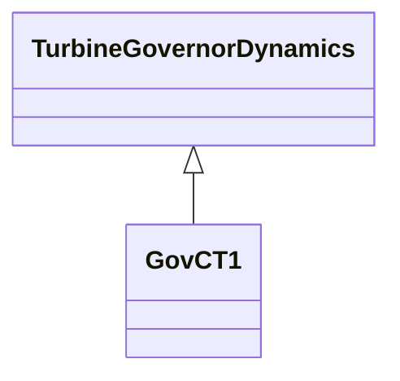

# GovCT1

General model for any prime mover with a PID governor, used primarily for combustion turbine and combined cycle units. This model can be used to represent a variety of prime movers controlled by PID governors. It is suitable, for example, for the representation of: gas turbine and single shaft combined cycle turbines diesel engines with modern electronic or digital governors steam turbines where steam is supplied from a large boiler drum or a large header whose pressure is substantially constant over the period under study simple hydro turbines in dam configurations where the water column length is short and water inertia effects are minimal. Additional information on this model is available in the 2012 IEEE report, Dynamic Models for Turbine-Governors in Power System Studies, 3.1.2.3 pages 3-4 (GGOV1).

## Inheritance

<button class="mermaid-enlarge-button">Enlarge Diagram</button>

## Attributes

| Label | Type | Multiplicity | Comment |
|-------|------|--------------|---------|
| aset | Float | 1..1 | Acceleration limiter setpoint (Aset). Unit = PU / s. Typical value = 0,01. |
| db | Float | 1..1 | Speed governor deadband in PU speed (db). In the majority of applications, it is recommended that this value be set to zero. Typical value = 0. |
| dm | Float | 1..1 | Speed sensitivity coefficient (Dm). Dm can represent either the variation of the engine power with the shaft speed or the variation of maximum power capability with shaft speed. If it is positive it describes the falling slope of the engine speed verses power characteristic as speed increases. A slightly falling characteristic is typical for reciprocating engines and some aero-derivative turbines. If it is negative the engine power is assumed to be unaffected by the shaft speed, but the maximum permissible fuel flow is taken to fall with falling shaft speed. This is characteristic of single-shaft industrial turbines due to exhaust temperature limits. Typical value = 0. |
| ka | Float | 1..1 | Acceleration limiter gain (Ka). Typical value = 10. |
| kdgov | Float | 1..1 | Governor derivative gain (Kdgov). Typical value = 0. |
| kigov | Float | 1..1 | Governor integral gain (Kigov). Typical value = 2. |
| kiload | Float | 1..1 | Load limiter integral gain for PI controller (Kiload). Typical value = 0,67. |
| kimw | Float | 1..1 | Power controller (reset) gain (Kimw). The default value of 0,01 corresponds to a reset time of 100 s. A value of 0,001 corresponds to a relatively slow-acting load controller. Typical value = 0,01. |
| kpgov | Float | 1..1 | Governor proportional gain (Kpgov). Typical value = 10. |
| kpload | Float | 1..1 | Load limiter proportional gain for PI controller (Kpload). Typical value = 2. |
| kturb | Float | 1..1 | Turbine gain (Kturb) (> 0). Typical value = 1,5. |
| ldref | Float | 1..1 | Load limiter reference value (Ldref). Typical value = 1. |
| maxerr | Float | 1..1 | Maximum value for speed error signal (maxerr) (> GovCT1.minerr). Typical value = 0,05. |
| minerr | Float | 1..1 | Minimum value for speed error signal (minerr) (< GovCT1.maxerr). Typical value = -0,05. |
| mwbase | Float | 1..1 | Base for power values (MWbase) (> 0). Unit = MW. |
| r | Float | 1..1 | Permanent droop (R). Typical value = 0,04. |
| rclose | Float | 1..1 | Minimum valve closing rate (Rclose). Unit = PU / s. Typical value = -0,1. |
| rdown | Float | 1..1 | Maximum rate of load limit decrease (Rdown). Typical value = -99. |
| ropen | Float | 1..1 | Maximum valve opening rate (Ropen). Unit = PU / s. Typical value = 0.10. |
| rselect | [DroopSignalFeedbackKind](DroopSignalFeedbackKind.md) | 1..1 | Feedback signal for droop (Rselect). Typical value = electricalPower. |
| rup | Float | 1..1 | Maximum rate of load limit increase (Rup). Typical value = 99. |
| ta | Float | 1..1 | Acceleration limiter time constant (Ta) (> 0). Typical value = 0,1. |
| tact | Float | 1..1 | Actuator time constant (Tact) (>= 0). Typical value = 0,5. |
| tb | Float | 1..1 | Turbine lag time constant (Tb) (> 0). Typical value = 0,5. |
| tc | Float | 1..1 | Turbine lead time constant (Tc) (>= 0). Typical value = 0. |
| tdgov | Float | 1..1 | Governor derivative controller time constant (Tdgov) (>= 0). Typical value = 1. |
| teng | Float | 1..1 | Transport time delay for diesel engine used in representing diesel engines where there is a small but measurable transport delay between a change in fuel flow setting and the development of torque (Teng) (>= 0). Teng should be zero in all but special cases where this transport delay is of particular concern. Typical value = 0. |
| tfload | Float | 1..1 | Load-limiter time constant (Tfload) (> 0). Typical value = 3. |
| tpelec | Float | 1..1 | Electrical power transducer time constant (Tpelec) (> 0). Typical value = 1. |
| tsa | Float | 1..1 | Temperature detection lead time constant (Tsa) (>= 0). Typical value = 4. |
| tsb | Float | 1..1 | Temperature detection lag time constant (Tsb) (>= 0). Typical value = 5. |
| vmax | Float | 1..1 | Maximum valve position limit (Vmax) (> GovCT1.vmin). Typical value = 1. |
| vmin | Float | 1..1 | Minimum valve position limit (Vmin) (< GovCT1.vmax). Typical value = 0,15. |
| wfnl | Float | 1..1 | No load fuel flow (Wfnl). Typical value = 0,2. |
| wfspd | Boolean | 1..1 | Switch for fuel source characteristic to recognize that fuel flow, for a given fuel valve stroke, can be proportional to engine speed (Wfspd). true = fuel flow proportional to speed (for some gas turbines and diesel engines with positive displacement fuel injectors) false = fuel control system keeps fuel flow independent of engine speed. Typical value = true. |

