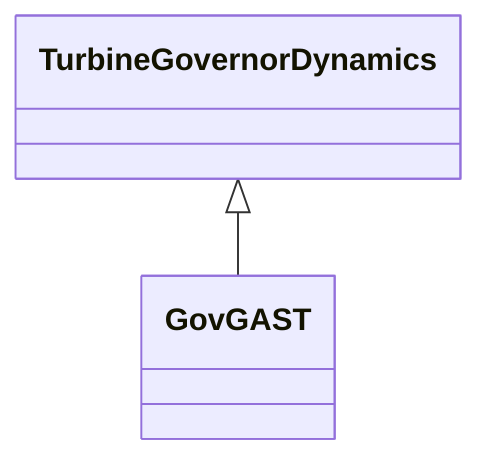

# GovGAST

Single shaft gas turbine.

## Inheritance

<button class="mermaid-enlarge-button">Enlarge Diagram</button>

## Attributes

| Label | Type | Multiplicity | Comment |
|-------|------|--------------|---------|
| at | Float | 1..1 | Ambient temperature load limit (Load Limit). Typical value = 1. |
| dturb | Float | 1..1 | Turbine damping factor (Dturb). Typical value = 0,18. |
| kt | Float | 1..1 | Temperature limiter gain (Kt). Typical value = 3. |
| mwbase | Float | 1..1 | Base for power values (MWbase) (> 0). Unit = MW. |
| r | Float | 1..1 | Permanent droop (R) (>0). Typical value = 0,04. |
| t1 | Float | 1..1 | Governor mechanism time constant (T1) (>= 0). T1 represents the natural valve positioning time constant of the governor for small disturbances, as seen when rate limiting is not in effect. Typical value = 0,5. |
| t2 | Float | 1..1 | Turbine power time constant (T2) (>= 0). T2 represents delay due to internal energy storage of the gas turbine engine. T2 can be used to give a rough approximation to the delay associated with acceleration of the compressor spool of a multi-shaft engine, or with the compressibility of gas in the plenum of a free power turbine of an aero-derivative unit, for example. Typical value = 0,5. |
| t3 | Float | 1..1 | Turbine exhaust temperature time constant (T3) (>= 0). Typical value = 3. |
| vmax | Float | 1..1 | Maximum turbine power, PU of MWbase (Vmax) (> GovGAST.vmin). Typical value = 1. |
| vmin | Float | 1..1 | Minimum turbine power, PU of MWbase (Vmin) (< GovGAST.vmax). Typical value = 0. |

