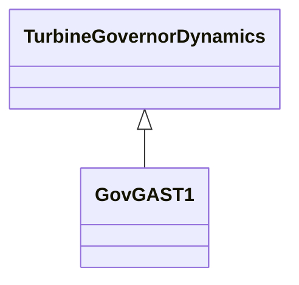

# GovGAST1

Modified single shaft gas turbine.

## Inheritance

<button class="mermaid-enlarge-button">Enlarge Diagram</button>

## Attributes

| Label | Type | Multiplicity | Comment |
|-------|------|--------------|---------|
| a | Float | 1..1 | Turbine power time constant numerator scale factor (a). Typical value = 0,8. |
| b | Float | 1..1 | Turbine power time constant denominator scale factor (b) (>0). Typical value = 1. |
| db1 | Float | 1..1 | Intentional dead-band width (db1). Unit = Hz. Typical value = 0. |
| db2 | Float | 1..1 | Unintentional dead-band (db2). Unit = MW. Typical value = 0. |
| eps | Float | 1..1 | Intentional db hysteresis (eps). Unit = Hz. Typical value = 0. |
| fidle | Float | 1..1 | Fuel flow at zero power output (Fidle). Typical value = 0,18. |
| gv1 | Float | 1..1 | Nonlinear gain point 1, PU gv (Gv1). Typical value = 0. |
| gv2 | Float | 1..1 | Nonlinear gain point 2,PU gv (Gv2). Typical value = 0. |
| gv3 | Float | 1..1 | Nonlinear gain point 3, PU gv (Gv3). Typical value = 0. |
| gv4 | Float | 1..1 | Nonlinear gain point 4, PU gv (Gv4). Typical value = 0. |
| gv5 | Float | 1..1 | Nonlinear gain point 5, PU gv (Gv5). Typical value = 0. |
| gv6 | Float | 1..1 | Nonlinear gain point 6, PU gv (Gv6). Typical value = 0. |
| ka | Float | 1..1 | Governor gain (Ka). Typical value = 0. |
| kt | Float | 1..1 | Temperature limiter gain (Kt). Typical value = 3. |
| lmax | Float | 1..1 | Ambient temperature load limit (Lmax). Lmax is the turbine power output corresponding to the limiting exhaust gas temperature. Typical value = 1. |
| loadinc | Float | 1..1 | Valve position change allowed at fast rate (Loadinc). Typical value = 0,05. |
| ltrate | Float | 1..1 | Maximum long term fuel valve opening rate (Ltrate). Typical value = 0,02. |
| mwbase | Float | 1..1 | Base for power values (MWbase) (> 0). Unit = MW. |
| pgv1 | Float | 1..1 | Nonlinear gain point 1, PU power (Pgv1). Typical value = 0. |
| pgv2 | Float | 1..1 | Nonlinear gain point 2, PU power (Pgv2). Typical value = 0. |
| pgv3 | Float | 1..1 | Nonlinear gain point 3, PU power (Pgv3). Typical value = 0. |
| pgv4 | Float | 1..1 | Nonlinear gain point 4, PU power (Pgv4). Typical value = 0. |
| pgv5 | Float | 1..1 | Nonlinear gain point 5, PU power (Pgv5). Typical value = 0. |
| pgv6 | Float | 1..1 | Nonlinear gain point 6, PU power (Pgv6). Typical value = 0. |
| r | Float | 1..1 | Permanent droop (R) (>0). Typical value = 0,04. |
| rmax | Float | 1..1 | Maximum fuel valve opening rate (Rmax). Unit = PU / s. Typical value = 1. |
| t1 | Float | 1..1 | Governor mechanism time constant (T1) (>= 0). T1 represents the natural valve positioning time constant of the governor for small disturbances, as seen when rate limiting is not in effect. Typical value = 0,5. |
| t2 | Float | 1..1 | Turbine power time constant (T2) (>= 0). T2 represents delay due to internal energy storage of the gas turbine engine. T2 can be used to give a rough approximation to the delay associated with acceleration of the compressor spool of a multi-shaft engine, or with the compressibility of gas in the plenum of the free power turbine of an aero-derivative unit, for example. Typical value = 0,5. |
| t3 | Float | 1..1 | Turbine exhaust temperature time constant (T3) (>= 0). T3 represents delay in the exhaust temperature and load limiting system. Typical value = 3. |
| t4 | Float | 1..1 | Governor lead time constant (T4) (>= 0). Typical value = 0. |
| t5 | Float | 1..1 | Governor lag time constant (T5) (>= 0). If = 0, entire gain and lead-lag block is bypassed. Typical value = 0. |
| tltr | Float | 1..1 | Valve position averaging time constant (Tltr) (>= 0). Typical value = 10. |
| vmax | Float | 1..1 | Maximum turbine power, PU of MWbase (Vmax) (> GovGAST1.vmin). Typical value = 1. |
| vmin | Float | 1..1 | Minimum turbine power, PU of MWbase (Vmin) (< GovGAST1.vmax). Typical value = 0. |

