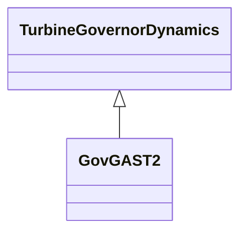

# GovGAST2

Gas turbine.

## Inheritance

<button class="mermaid-enlarge-button">Enlarge Diagram</button>

## Attributes

| Label | Type | Multiplicity | Comment |
|-------|------|--------------|---------|
| a | Float | 1..1 | Valve positioner (A). |
| af1 | Float | 1..1 | Exhaust temperature parameter (Af1). Unit = PU temperature. Based on temperature in degrees C. |
| af2 | Float | 1..1 | Coefficient equal to 0,5(1-speed) (Af2). |
| b | Float | 1..1 | Valve positioner (B). |
| bf1 | Float | 1..1 | (Bf1). Bf1 = E(1 - W) where E (speed sensitivity coefficient) is 0,55 to 0,65 x Tr. Unit = PU temperature. Based on temperature in degrees C. |
| bf2 | Float | 1..1 | Turbine torque coefficient Khhv (depends on heating value of fuel stream in combustion chamber) (Bf2). |
| c | Float | 1..1 | Valve positioner (C). |
| cf2 | Float | 1..1 | Coefficient defining fuel flow where power output is 0% (Cf2). Synchronous but no output. Typically 0,23 x Khhv (23% fuel flow). |
| ecr | Float | 1..1 | Combustion reaction time delay (Ecr) (>= 0). |
| etd | Float | 1..1 | Turbine and exhaust delay (Etd) (>= 0). |
| k3 | Float | 1..1 | Ratio of fuel adjustment (K3). |
| k4 | Float | 1..1 | Gain of radiation shield (K4). |
| k5 | Float | 1..1 | Gain of radiation shield (K5). |
| k6 | Float | 1..1 | Minimum fuel flow (K6). |
| kf | Float | 1..1 | Fuel system feedback (Kf). |
| mwbase | Float | 1..1 | Base for power values (MWbase) (> 0). Unit = MW. |
| t | Float | 1..1 | Fuel control time constant (T) (>= 0). |
| t3 | Float | 1..1 | Radiation shield time constant (T3) (>= 0). |
| t4 | Float | 1..1 | Thermocouple time constant (T4) (>= 0). |
| t5 | Float | 1..1 | Temperature control time constant (T5) (>= 0). |
| tc | Float | 1..1 | Temperature control (Tc). Unit = °F or °C depending on parameters Af1 and Bf1. |
| tcd | Float | 1..1 | Compressor discharge time constant (Tcd) (>= 0). |
| tf | Float | 1..1 | Fuel system time constant (Tf) (>= 0). |
| tmax | Float | 1..1 | Maximum turbine limit (Tmax) (> GovGAST2.tmin). |
| tmin | Float | 1..1 | Minimum turbine limit (Tmin) (< GovGAST2.tmax). |
| tr | Float | 1..1 | Rated temperature (Tr). Unit = °C depending on parameters Af1 and Bf1. |
| trate | Float | 1..1 | Turbine rating (Trate). Unit = MW. |
| tt | Float | 1..1 | Temperature controller integration rate (Tt) (>= 0). |
| w | Float | 1..1 | Governor gain (1/droop) on turbine rating (W). |
| x | Float | 1..1 | Governor lead time constant (X) (>= 0). |
| y | Float | 1..1 | Governor lag time constant (Y) (> 0). |
| z | Integer | 1..1 | Governor mode (Z). 1 = droop 0 = isochronous. |

