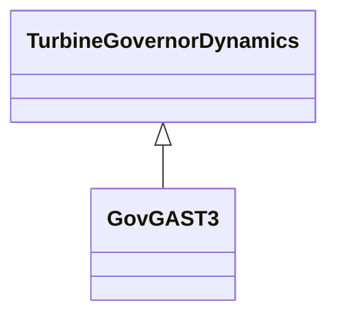

# GovGAST3

Generic turbogas with acceleration and temperature controller.

## Inheritance

<button class="mermaid-enlarge-button">Enlarge Diagram</button>

## Attributes

| Label | Type | Multiplicity | Comment |
|-------|------|--------------|---------|
| bca | Float | 1..1 | Acceleration limit set-point (Bca). Unit = 1/s. Typical value = 0,01. |
| bp | Float | 1..1 | Droop (bp). Typical value = 0,05. |
| dtc | Float | 1..1 | Exhaust temperature variation due to fuel flow increasing from 0 to 1 PU (deltaTc). Typical value = 390. |
| ka | Float | 1..1 | Minimum fuel flow (Ka). Typical value = 0,23. |
| kac | Float | 1..1 | Fuel system feedback (KAC). Typical value = 0. |
| kca | Float | 1..1 | Acceleration control integral gain (Kca). Unit = 1/s. Typical value = 100. |
| ksi | Float | 1..1 | Gain of radiation shield (Ksi). Typical value = 0,8. |
| ky | Float | 1..1 | Coefficient of transfer function of fuel valve positioner (Ky). Typical value = 1. |
| mnef | Float | 1..1 | Fuel flow maximum negative error value (MNef). Typical value = -0,05. |
| mxef | Float | 1..1 | Fuel flow maximum positive error value (MXef). Typical value = 0,05. |
| rcmn | Float | 1..1 | Minimum fuel flow (RCMN). Typical value = -0,1. |
| rcmx | Float | 1..1 | Maximum fuel flow (RCMX). Typical value = 1. |
| tac | Float | 1..1 | Fuel control time constant (Tac) (>= 0). Typical value = 0,1. |
| tc | Float | 1..1 | Compressor discharge volume time constant (Tc) (>= 0). Typical value = 0,2. |
| td | Float | 1..1 | Temperature controller derivative gain (Td) (>= 0). Typical value = 3,3. |
| tfen | Float | 1..1 | Turbine rated exhaust temperature correspondent to Pm=1 PU (Tfen). Typical value = 540. |
| tg | Float | 1..1 | Time constant of speed governor (Tg) (>= 0). Typical value = 0,05. |
| tsi | Float | 1..1 | Time constant of radiation shield (Tsi) (>= 0). Typical value = 15. |
| tt | Float | 1..1 | Temperature controller integration rate (Tt). Typical value = 250. |
| ttc | Float | 1..1 | Time constant of thermocouple (Ttc) (>= 0). Typical value = 2,5. |
| ty | Float | 1..1 | Time constant of fuel valve positioner (Ty) (>= 0). Typical value = 0,2. |

