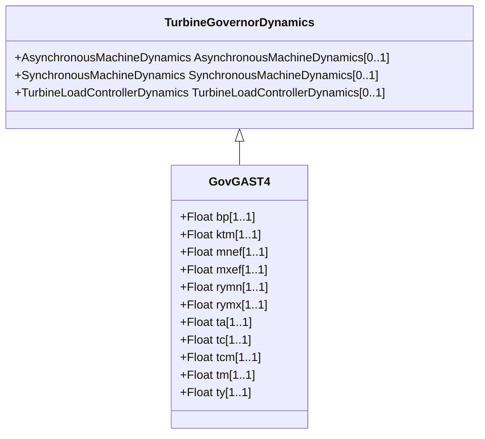

# GovGAST4

Generic turbogas.

## Inheritance

<button class="mermaid-enlarge-button">Enlarge Diagram</button>

## Attributes

| Label | Type | Multiplicity | Comment |
|-------|------|--------------|---------|
| bp | Float | 1..1 | Droop (bp). Typical value = 0,05. |
| ktm | Float | 1..1 | Compressor gain (Ktm). Typical value = 0. |
| mnef | Float | 1..1 | Fuel flow maximum negative error value (MNef). Typical value = -0,05. |
| mxef | Float | 1..1 | Fuel flow maximum positive error value (MXef). Typical value = 0,05. |
| rymn | Float | 1..1 | Minimum valve opening (RYMN). Typical value = 0. |
| rymx | Float | 1..1 | Maximum valve opening (RYMX). Typical value = 1,1. |
| ta | Float | 1..1 | Maximum gate opening velocity (TA) (>= 0). Typical value = 3. |
| tc | Float | 1..1 | Maximum gate closing velocity (TC) (>= 0). Typical value = 0,5. |
| tcm | Float | 1..1 | Fuel control time constant (Tcm) (>= 0). Typical value = 0,1. |
| tm | Float | 1..1 | Compressor discharge volume time constant (Tm) (>= 0). Typical value = 0,2. |
| ty | Float | 1..1 | Time constant of fuel valve positioner (Ty) (>= 0). Typical value = 0,1. |

