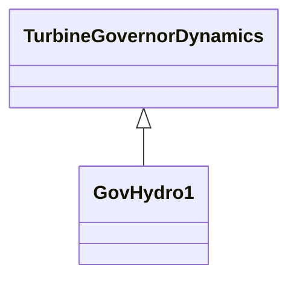

# GovHydro1

Basic hydro turbine governor.

## Inheritance

<button class="mermaid-enlarge-button">Enlarge Diagram</button>

## Attributes

| Label | Type | Multiplicity | Comment |
|-------|------|--------------|---------|
| at | Float | 1..1 | Turbine gain (At) (> 0). Typical value = 1,2. |
| dturb | Float | 1..1 | Turbine damping factor (Dturb) (>= 0). Typical value = 0,5. |
| gmax | Float | 1..1 | Maximum gate opening (Gmax) (> 0 and > GovHydro.gmin). Typical value = 1. |
| gmin | Float | 1..1 | Minimum gate opening (Gmin) (>= 0 and < GovHydro1.gmax). Typical value = 0. |
| hdam | Float | 1..1 | Turbine nominal head (hdam). Typical value = 1. |
| mwbase | Float | 1..1 | Base for power values (MWbase) (> 0). Unit = MW. |
| qnl | Float | 1..1 | No-load flow at nominal head (qnl) (>= 0). Typical value = 0,08. |
| rperm | Float | 1..1 | Permanent droop (R) (> 0). Typical value = 0,04. |
| rtemp | Float | 1..1 | Temporary droop (r) (> GovHydro1.rperm). Typical value = 0,3. |
| tf | Float | 1..1 | Filter time constant (Tf) (> 0). Typical value = 0,05. |
| tg | Float | 1..1 | Gate servo time constant (Tg) (> 0). Typical value = 0,5. |
| tr | Float | 1..1 | Washout time constant (Tr) (> 0). Typical value = 5. |
| tw | Float | 1..1 | Water inertia time constant (Tw) (> 0). Typical value = 1. |
| velm | Float | 1..1 | Maximum gate velocity (Vlem) (> 0). Typical value = 0,2. |

