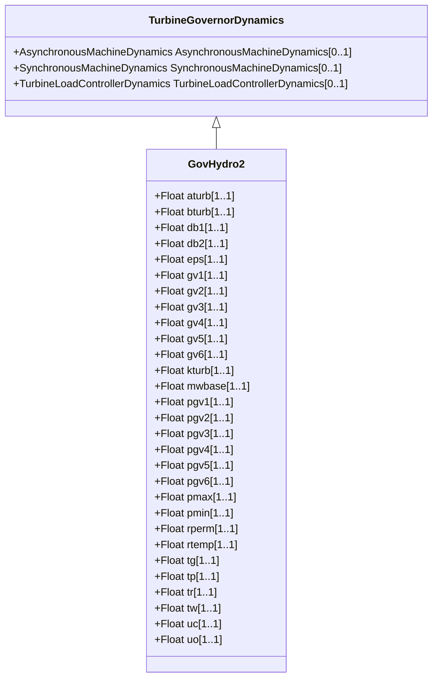

# GovHydro2

IEEE hydro turbine governor with straightforward penstock configuration and hydraulic-dashpot governor.

## Inheritance

<button class="mermaid-enlarge-button">Enlarge Diagram</button>

## Attributes

| Label | Type | Multiplicity | Comment |
|-------|------|--------------|---------|
| aturb | Float | 1..1 | Turbine numerator multiplier (Aturb). Typical value = -1. |
| bturb | Float | 1..1 | Turbine denominator multiplier (Bturb) (> 0). Typical value = 0,5. |
| db1 | Float | 1..1 | Intentional deadband width (db1). Unit = Hz. Typical value = 0. |
| db2 | Float | 1..1 | Unintentional deadband (db2). Unit = MW. Typical value = 0. |
| eps | Float | 1..1 | Intentional db hysteresis (eps). Unit = Hz. Typical value = 0. |
| gv1 | Float | 1..1 | Nonlinear gain point 1, PU gv (Gv1). Typical value = 0. |
| gv2 | Float | 1..1 | Nonlinear gain point 2, PU gv (Gv2). Typical value = 0. |
| gv3 | Float | 1..1 | Nonlinear gain point 3, PU gv (Gv3). Typical value = 0. |
| gv4 | Float | 1..1 | Nonlinear gain point 4, PU gv (Gv4). Typical value = 0. |
| gv5 | Float | 1..1 | Nonlinear gain point 5, PU gv (Gv5). Typical value = 0. |
| gv6 | Float | 1..1 | Nonlinear gain point 6, PU gv (Gv6). Typical value = 0. |
| kturb | Float | 1..1 | Turbine gain (Kturb). Typical value = 1. |
| mwbase | Float | 1..1 | Base for power values (MWbase) (> 0). Unit = MW. |
| pgv1 | Float | 1..1 | Nonlinear gain point 1, PU power (Pgv1). Typical value = 0. |
| pgv2 | Float | 1..1 | Nonlinear gain point 2, PU power (Pgv2). Typical value = 0. |
| pgv3 | Float | 1..1 | Nonlinear gain point 3, PU power (Pgv3). Typical value = 0. |
| pgv4 | Float | 1..1 | Nonlinear gain point 4, PU power (Pgv4). Typical value = 0. |
| pgv5 | Float | 1..1 | Nonlinear gain point 5, PU power (Pgv5). Typical value = 0. |
| pgv6 | Float | 1..1 | Nonlinear gain point 6, PU power (Pgv6). Typical value = 0. |
| pmax | Float | 1..1 | Maximum gate opening (Pmax) (> GovHydro2.pmin). Typical value = 1. |
| pmin | Float | 1..1 | Minimum gate opening (Pmin) (< GovHydro2.pmax). Typical value = 0. |
| rperm | Float | 1..1 | Permanent droop (Rperm). Typical value = 0,05. |
| rtemp | Float | 1..1 | Temporary droop (Rtemp). Typical value = 0,5. |
| tg | Float | 1..1 | Gate servo time constant (Tg) (> 0). Typical value = 0,5. |
| tp | Float | 1..1 | Pilot servo valve time constant (Tp) (>= 0). Typical value = 0,03. |
| tr | Float | 1..1 | Dashpot time constant (Tr) (>= 0). Typical value = 12. |
| tw | Float | 1..1 | Water inertia time constant (Tw) (>= 0). Typical value = 2. |
| uc | Float | 1..1 | Maximum gate closing velocity (Uc) (< 0). Unit = PU / s. Typical value = -0,1. |
| uo | Float | 1..1 | Maximum gate opening velocity (Uo). Unit = PU / s. Typical value = 0,1. |

