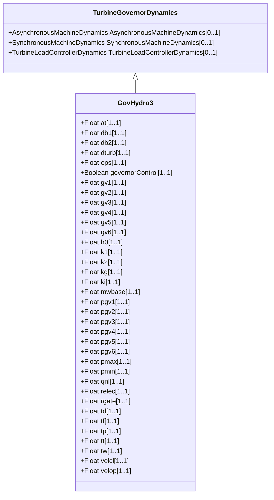

# GovHydro3

Modified IEEE hydro governor-turbine. This model differs from that defined in the IEEE modelling guideline paper in that the limits on gate position and velocity do not permit 'wind up' of the upstream signals.

## Inheritance

<button class="mermaid-enlarge-button">Enlarge Diagram</button>

## Attributes

| Label | Type | Multiplicity | Comment |
|-------|------|--------------|---------|
| at | Float | 1..1 | Turbine gain (At) (>0). Typical value = 1,2. |
| db1 | Float | 1..1 | Intentional dead-band width (db1). Unit = Hz. Typical value = 0. |
| db2 | Float | 1..1 | Unintentional dead-band (db2). Unit = MW. Typical value = 0. |
| dturb | Float | 1..1 | Turbine damping factor (Dturb). Typical value = 0,2. |
| eps | Float | 1..1 | Intentional db hysteresis (eps). Unit = Hz. Typical value = 0. |
| governorControl | Boolean | 1..1 | Governor control flag (Cflag). true = PID control is active false = double derivative control is active. Typical value = true. |
| gv1 | Float | 1..1 | Nonlinear gain point 1, PU gv (Gv1). Typical value = 0. |
| gv2 | Float | 1..1 | Nonlinear gain point 2, PU gv (Gv2). Typical value = 0. |
| gv3 | Float | 1..1 | Nonlinear gain point 3, PU gv (Gv3). Typical value = 0. |
| gv4 | Float | 1..1 | Nonlinear gain point 4, PU gv (Gv4). Typical value = 0. |
| gv5 | Float | 1..1 | Nonlinear gain point 5, PU gv (Gv5). Typical value = 0. |
| gv6 | Float | 1..1 | Nonlinear gain point 6, PU gv (Gv6). Typical value = 0. |
| h0 | Float | 1..1 | Turbine nominal head (H0). Typical value = 1. |
| k1 | Float | 1..1 | Derivative gain (K1). Typical value = 0,01. |
| k2 | Float | 1..1 | Double derivative gain, if Cflag = -1 (K2). Typical value = 2,5. |
| kg | Float | 1..1 | Gate servo gain (Kg). Typical value = 2. |
| ki | Float | 1..1 | Integral gain (Ki). Typical value = 0,5. |
| mwbase | Float | 1..1 | Base for power values (MWbase) (> 0). Unit = MW. |
| pgv1 | Float | 1..1 | Nonlinear gain point 1, PU power (Pgv1). Typical value = 0. |
| pgv2 | Float | 1..1 | Nonlinear gain point 2, PU power (Pgv2). Typical value = 0. |
| pgv3 | Float | 1..1 | Nonlinear gain point 3, PU power (Pgv3). Typical value = 0. |
| pgv4 | Float | 1..1 | Nonlinear gain point 4, PU power (Pgv4). Typical value = 0. |
| pgv5 | Float | 1..1 | Nonlinear gain point 5, PU power (Pgv5). Typical value = 0. |
| pgv6 | Float | 1..1 | Nonlinear gain point 6, PU power (Pgv6). Typical value = 0. |
| pmax | Float | 1..1 | Maximum gate opening, PU of MWbase (Pmax) (> GovHydro3.pmin). Typical value = 1. |
| pmin | Float | 1..1 | Minimum gate opening, PU of MWbase (Pmin) (< GovHydro3.pmax). Typical value = 0. |
| qnl | Float | 1..1 | No-load turbine flow at nominal head (Qnl). Typical value = 0,08. |
| relec | Float | 1..1 | Steady-state droop, PU, for electrical power feedback (Relec). Typical value = 0,05. |
| rgate | Float | 1..1 | Steady-state droop, PU, for governor output feedback (Rgate). Typical value = 0. |
| td | Float | 1..1 | Input filter time constant (Td) (>= 0). Typical value = 0,05. |
| tf | Float | 1..1 | Washout time constant (Tf) (>= 0). Typical value = 0,1. |
| tp | Float | 1..1 | Gate servo time constant (Tp) (>= 0). Typical value = 0,05. |
| tt | Float | 1..1 | Power feedback time constant (Tt) (>= 0). Typical value = 0,2. |
| tw | Float | 1..1 | Water inertia time constant (Tw) (>= 0). If = 0, block is bypassed. Typical value = 1. |
| velcl | Float | 1..1 | Maximum gate closing velocity (Velcl). Unit = PU / s. Typical value = -0,2. |
| velop | Float | 1..1 | Maximum gate opening velocity (Velop). Unit = PU / s. Typical value = 0,2. |

