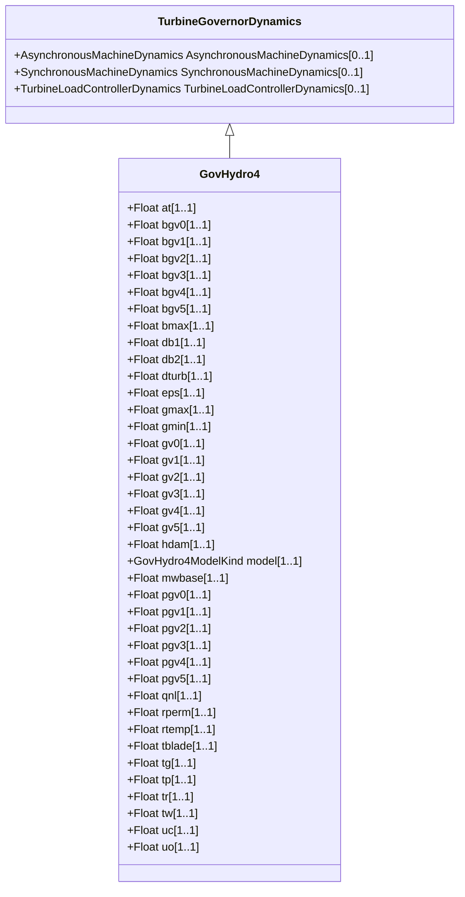

# GovHydro4

Hydro turbine and governor. Represents plants with straight-forward penstock configurations and hydraulic governors of the traditional 'dashpot' type. This model can be used to represent simple, Francis/Pelton or Kaplan turbines.

## Inheritance

<button class="mermaid-enlarge-button">Enlarge Diagram</button>

## Attributes

| Label | Type | Multiplicity | Comment |
|-------|------|--------------|---------|
| at | Float | 1..1 | Turbine gain (At). Typical value = 1,2. |
| bgv0 | Float | 1..1 | Kaplan blade servo point 0 (Bgv0) (= 0 for simple, = 0 for Francis/Pelton). Typical value for Kaplan = 0. |
| bgv1 | Float | 1..1 | Kaplan blade servo point 1 (Bgv1) (= 0 for simple, = 0 for Francis/Pelton). Typical value for Kaplan = 0. |
| bgv2 | Float | 1..1 | Kaplan blade servo point 2 (Bgv2) (= 0 for simple, = 0 for Francis/Pelton). Typical value for Kaplan = 0,1. |
| bgv3 | Float | 1..1 | Kaplan blade servo point 3 (Bgv3) (= 0 for simple, = 0 for Francis/Pelton). Typical value for Kaplan = 0,667. |
| bgv4 | Float | 1..1 | Kaplan blade servo point 4 (Bgv4) (= 0 for simple, = 0 for Francis/Pelton). Typical value for Kaplan = 0,9. |
| bgv5 | Float | 1..1 | Kaplan blade servo point 5 (Bgv5) (= 0 for simple, = 0 for Francis/Pelton). Typical value for Kaplan = 1. |
| bmax | Float | 1..1 | Maximum blade adjustment factor (Bmax) (= 0 for simple, = 0 for Francis/Pelton). Typical value for Kaplan = 1,1276. |
| db1 | Float | 1..1 | Intentional deadband width (db1). Unit = Hz. Typical value = 0. |
| db2 | Float | 1..1 | Unintentional dead-band (db2). Unit = MW. Typical value = 0. |
| dturb | Float | 1..1 | Turbine damping factor (Dturb). Unit = delta P (PU of MWbase) / delta speed (PU). Typical value for simple = 0,5, Francis/Pelton = 1,1, Kaplan = 1,1. |
| eps | Float | 1..1 | Intentional db hysteresis (eps). Unit = Hz. Typical value = 0. |
| gmax | Float | 1..1 | Maximum gate opening, PU of MWbase (Gmax) (> GovHydro4.gmin). Typical value = 1. |
| gmin | Float | 1..1 | Minimum gate opening, PU of MWbase (Gmin) (< GovHydro4.gmax). Typical value = 0. |
| gv0 | Float | 1..1 | Nonlinear gain point 0, PU gv (Gv0) (= 0 for simple). Typical for Francis/Pelton = 0,1, Kaplan = 0,1. |
| gv1 | Float | 1..1 | Nonlinear gain point 1, PU gv (Gv1) (= 0 for simple, > GovHydro4.gv0 for Francis/Pelton and Kaplan). Typical value for Francis/Pelton = 0,4, Kaplan = 0,4. |
| gv2 | Float | 1..1 | Nonlinear gain point 2, PU gv (Gv2) (= 0 for simple, > GovHydro4.gv1 for Francis/Pelton and Kaplan). Typical value for Francis/Pelton = 0,5, Kaplan = 0,5. |
| gv3 | Float | 1..1 | Nonlinear gain point 3, PU gv (Gv3) (= 0 for simple, > GovHydro4.gv2 for Francis/Pelton and Kaplan). Typical value for Francis/Pelton = 0,7, Kaplan = 0,7. |
| gv4 | Float | 1..1 | Nonlinear gain point 4, PU gv (Gv4) (= 0 for simple, > GovHydro4.gv3 for Francis/Pelton and Kaplan). Typical value for Francis/Pelton = 0,8, Kaplan = 0,8. |
| gv5 | Float | 1..1 | Nonlinear gain point 5, PU gv (Gv5) (= 0 for simple, < 1 and > GovHydro4.gv4 for Francis/Pelton and Kaplan). Typical value for Francis/Pelton = 0,9, Kaplan = 0,9. |
| hdam | Float | 1..1 | Head available at dam (hdam). Typical value = 1. |
| model | [GovHydro4ModelKind](GovHydro4ModelKind.md) | 1..1 | The kind of model being represented (simple, Francis/Pelton or Kaplan). |
| mwbase | Float | 1..1 | Base for power values (MWbase) (> 0). Unit = MW. |
| pgv0 | Float | 1..1 | Nonlinear gain point 0, PU power (Pgv0) (= 0 for simple). Typical value = 0. |
| pgv1 | Float | 1..1 | Nonlinear gain point 1, PU power (Pgv1) (= 0 for simple). Typical value for Francis/Pelton = 0,42, Kaplan = 0,35. |
| pgv2 | Float | 1..1 | Nonlinear gain point 2, PU power (Pgv2) (= 0 for simple). Typical value for Francis/Pelton = 0,56, Kaplan = 0,468. |
| pgv3 | Float | 1..1 | Nonlinear gain point 3, PU power (Pgv3) (= 0 for simple). Typical value for Francis/Pelton = 0,8, Kaplan = 0,796. |
| pgv4 | Float | 1..1 | Nonlinear gain point 4, PU power (Pgv4) (= 0 for simple). Typical value for Francis/Pelton = 0,9, Kaplan = 0,917. |
| pgv5 | Float | 1..1 | Nonlinear gain point 5, PU power (Pgv5) (= 0 for simple). Typical value for Francis/Pelton = 0,97, Kaplan = 0,99. |
| qnl | Float | 1..1 | No-load flow at nominal head (Qnl). Typical value for simple = 0,08, Francis/Pelton = 0, Kaplan = 0. |
| rperm | Float | 1..1 | Permanent droop (Rperm) (>= 0). Typical value = 0,05. |
| rtemp | Float | 1..1 | Temporary droop (Rtemp) (>= 0). Typical value = 0,3. |
| tblade | Float | 1..1 | Blade servo time constant (Tblade) (>= 0). Typical value = 100. |
| tg | Float | 1..1 | Gate servo time constant (Tg) (> 0). Typical value = 0,5. |
| tp | Float | 1..1 | Pilot servo time constant (Tp) (>= 0). Typical value = 0,1. |
| tr | Float | 1..1 | Dashpot time constant (Tr) (>= 0). Typical value = 5. |
| tw | Float | 1..1 | Water inertia time constant (Tw) (> 0). Typical value = 1. |
| uc | Float | 1..1 | Max gate closing velocity (Uc). Typical value = 0,2. |
| uo | Float | 1..1 | Max gate opening velocity (Uo). Typical value = 0,2. |

