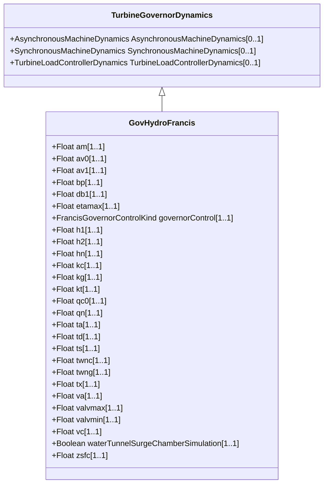

# GovHydroFrancis

Detailed hydro unit - Francis model. This model can be used to represent three types of governors. A schematic of the hydraulic system of detailed hydro unit models, such as Francis and Pelton, is provided in the DetailedHydroModelHydraulicSystem diagram.

## Inheritance

<button class="mermaid-enlarge-button">Enlarge Diagram</button>

## Attributes

| Label | Type | Multiplicity | Comment |
|-------|------|--------------|---------|
| am | Float | 1..1 | Opening section SEFF at the maximum efficiency (Am). Typical value = 0,7. |
| av0 | Float | 1..1 | Area of the surge tank (AV0). Unit = m2. Typical value = 30. |
| av1 | Float | 1..1 | Area of the compensation tank (AV1). Unit = m2. Typical value = 700. |
| bp | Float | 1..1 | Droop (Bp). Typical value = 0,05. |
| db1 | Float | 1..1 | Intentional dead-band width (DB1). Unit = Hz. Typical value = 0. |
| etamax | Float | 1..1 | Maximum efficiency (EtaMax). Typical value = 1,05. |
| governorControl | [FrancisGovernorControlKind](FrancisGovernorControlKind.md) | 1..1 | Governor control flag (Cflag). Typical value = mechanicHydrolicTachoAccelerator. |
| h1 | Float | 1..1 | Head of compensation chamber water level with respect to the level of penstock (H1). Unit = km. Typical value = 0,004. |
| h2 | Float | 1..1 | Head of surge tank water level with respect to the level of penstock (H2). Unit = km. Typical value = 0,040. |
| hn | Float | 1..1 | Rated hydraulic head (Hn). Unit = km. Typical value = 0,250. |
| kc | Float | 1..1 | Penstock loss coefficient (due to friction) (Kc). Typical value = 0,025. |
| kg | Float | 1..1 | Water tunnel and surge chamber loss coefficient (due to friction) (Kg). Typical value = 0,025. |
| kt | Float | 1..1 | Washout gain (Kt). Typical value = 0,25. |
| qc0 | Float | 1..1 | No-load turbine flow at nominal head (Qc0). Typical value = 0,1. |
| qn | Float | 1..1 | Rated flow (Qn). Unit = m3/s. Typical value = 250. |
| ta | Float | 1..1 | Derivative gain (Ta) (>= 0). Typical value = 3. |
| td | Float | 1..1 | Washout time constant (Td) (>= 0). Typical value = 6. |
| ts | Float | 1..1 | Gate servo time constant (Ts) (>= 0). Typical value = 0,5. |
| twnc | Float | 1..1 | Water inertia time constant (Twnc) (>= 0). Typical value = 1. |
| twng | Float | 1..1 | Water tunnel and surge chamber inertia time constant (Twng) (>= 0). Typical value = 3. |
| tx | Float | 1..1 | Derivative feedback gain (Tx) (>= 0). Typical value = 1. |
| va | Float | 1..1 | Maximum gate opening velocity (Va). Unit = PU / s. Typical value = 0,06. |
| valvmax | Float | 1..1 | Maximum gate opening (ValvMax) (> GovHydroFrancis.valvmin). Typical value = 1,1. |
| valvmin | Float | 1..1 | Minimum gate opening (ValvMin) (< GovHydroFrancis.valvmax). Typical value = 0. |
| vc | Float | 1..1 | Maximum gate closing velocity (Vc). Unit = PU / s. Typical value = -0,06. |
| waterTunnelSurgeChamberSimulation | Boolean | 1..1 | Water tunnel and surge chamber simulation (Tflag). true = enable of water tunnel and surge chamber simulation false = inhibit of water tunnel and surge chamber simulation. Typical value = false. |
| zsfc | Float | 1..1 | Head of upper water level with respect to the level of penstock (Zsfc). Unit = km. Typical value = 0,025. |

