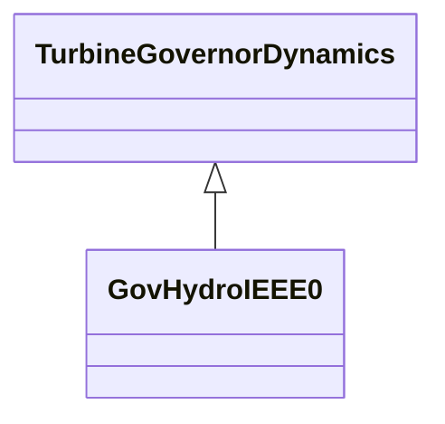

# GovHydroIEEE0

IEEE simplified hydro governor-turbine model. Used for mechanical-hydraulic and electro-hydraulic turbine governors, with or without steam feedback. Typical values given are for mechanical-hydraulic turbine-governor. Reference: IEEE Transactions on Power Apparatus and Systems, November/December 1973, Volume PAS-92, Number 6, Dynamic Models for Steam and Hydro Turbines in Power System Studies, page 1904.

## Inheritance

<button class="mermaid-enlarge-button">Enlarge Diagram</button>

## Attributes

| Label | Type | Multiplicity | Comment |
|-------|------|--------------|---------|
| k | Float | 1..1 | Governor gain (K). |
| mwbase | Float | 1..1 | Base for power values (MWbase) (> 0). Unit = MW. |
| pmax | Float | 1..1 | Gate maximum (Pmax) (> GovHydroIEEE0.pmin). |
| pmin | Float | 1..1 | Gate minimum (Pmin) (< GovHydroIEEE.pmax). |
| t1 | Float | 1..1 | Governor lag time constant (T1) (>= 0). Typical value = 0,25. |
| t2 | Float | 1..1 | Governor lead time constant (T2) (>= 0). Typical value = 0. |
| t3 | Float | 1..1 | Gate actuator time constant (T3) (>= 0). Typical value = 0,1. |
| t4 | Float | 1..1 | Water starting time (T4) (>= 0). |

