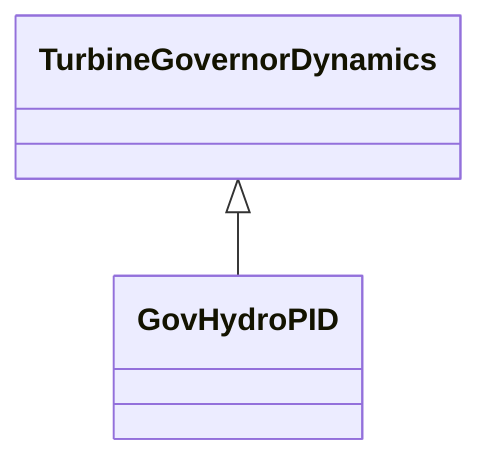

# GovHydroPID

PID governor and turbine.

## Inheritance

<button class="mermaid-enlarge-button">Enlarge Diagram</button>

## Attributes

| Label | Type | Multiplicity | Comment |
|-------|------|--------------|---------|
| aturb | Float | 1..1 | Turbine numerator multiplier (Aturb) (see parameter detail 3). Typical value -1. |
| bturb | Float | 1..1 | Turbine denominator multiplier (Bturb) (see parameter detail 3). Typical value = 0,5. |
| db1 | Float | 1..1 | Intentional dead-band width (db1). Unit = Hz. Typical value = 0. |
| db2 | Float | 1..1 | Unintentional dead-band (db2). Unit = MW. Typical value = 0. |
| eps | Float | 1..1 | Intentional db hysteresis (eps). Unit = Hz. Typical value = 0. |
| gv1 | Float | 1..1 | Nonlinear gain point 1, PU gv (Gv1). Typical value = 0. |
| gv2 | Float | 1..1 | Nonlinear gain point 2, PU gv (Gv2). Typical value = 0. |
| gv3 | Float | 1..1 | Nonlinear gain point 3, PU gv (Gv3). Typical value = 0. |
| gv4 | Float | 1..1 | Nonlinear gain point 4, PU gv (Gv4). Typical value = 0. |
| gv5 | Float | 1..1 | Nonlinear gain point 5, PU gv (Gv5). Typical value = 0. |
| gv6 | Float | 1..1 | Nonlinear gain point 6, PU gv (Gv6). Typical value = 0. |
| inputSignal | Boolean | 1..1 | Input signal switch (Flag). true = Pe input is used false = feedback is received from CV. Flag is normally dependent on Tt. If Tt is zero, Flag is set to false. If Tt is not zero, Flag is set to true. Typical value = true. |
| kd | Float | 1..1 | Derivative gain (Kd). Typical value = 1,11. |
| kg | Float | 1..1 | Gate servo gain (Kg). Typical value = 2,5. |
| ki | Float | 1..1 | Integral gain (Ki). Typical value = 0,36. |
| kp | Float | 1..1 | Proportional gain (Kp). Typical value = 0,1. |
| mwbase | Float | 1..1 | Base for power values (MWbase) (> 0). Unit = MW. |
| pgv1 | Float | 1..1 | Nonlinear gain point 1, PU power (Pgv1). Typical value = 0. |
| pgv2 | Float | 1..1 | Nonlinear gain point 2, PU power (Pgv2). Typical value = 0. |
| pgv3 | Float | 1..1 | Nonlinear gain point 3, PU power (Pgv3). Typical value = 0. |
| pgv4 | Float | 1..1 | Nonlinear gain point 4, PU power (Pgv4). Typical value = 0. |
| pgv5 | Float | 1..1 | Nonlinear gain point 5, PU power (Pgv5). Typical value = 0. |
| pgv6 | Float | 1..1 | Nonlinear gain point 6, PU power (Pgv6). Typical value = 0. |
| pmax | Float | 1..1 | Maximum gate opening, PU of MWbase (Pmax) (> GovHydroPID.pmin). Typical value = 1. |
| pmin | Float | 1..1 | Minimum gate opening, PU of MWbase (Pmin) (< GovHydroPID.pmax). Typical value = 0. |
| r | Float | 1..1 | Steady state droop (R). Typical value = 0,05. |
| td | Float | 1..1 | Input filter time constant (Td) (>= 0). If = 0, block is bypassed. Typical value = 0. |
| tf | Float | 1..1 | Washout time constant (Tf) (>= 0). Typical value = 0,1. |
| tp | Float | 1..1 | Gate servo time constant (Tp) (>= 0). If = 0, block is bypassed. Typical value = 0,35. |
| tt | Float | 1..1 | Power feedback time constant (Tt) (>= 0). If = 0, block is bypassed. Typical value = 0,02. |
| tturb | Float | 1..1 | Turbine time constant (Tturb) (>= 0). See Parameter detail 3. Typical value = 0,8. |
| velcl | Float | 1..1 | Maximum gate closing velocity (Velcl). Unit = PU / s. Typical value = -0,14. |
| velop | Float | 1..1 | Maximum gate opening velocity (Velop). Unit = PU / s. Typical value = 0,09. |

