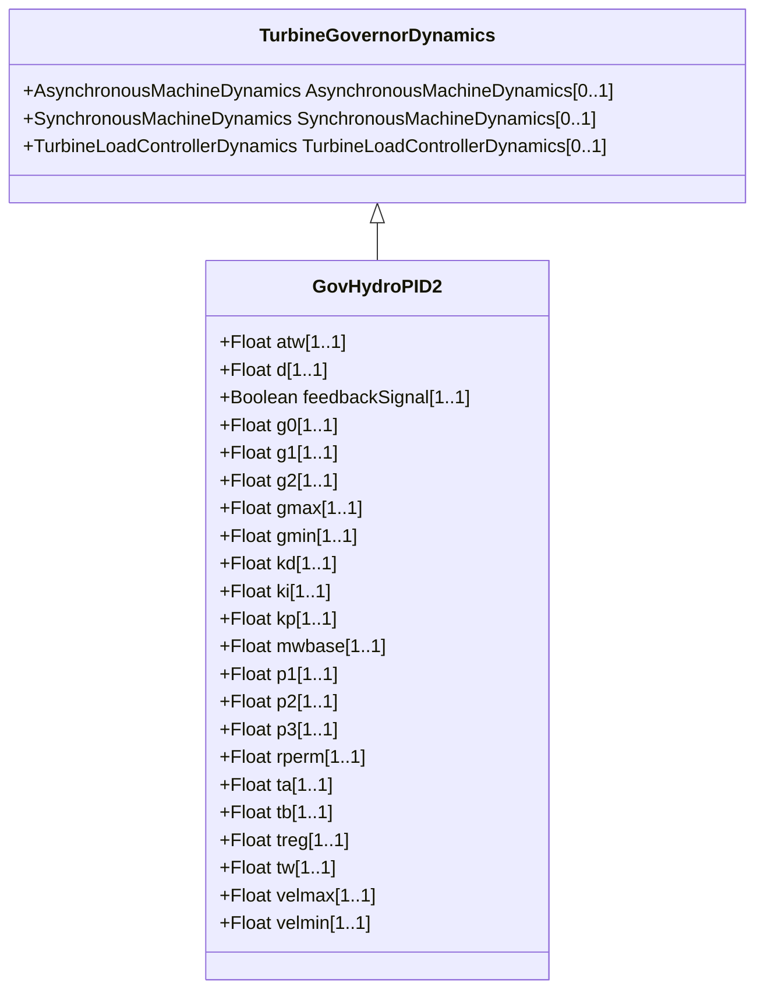

# GovHydroPID2

Hydro turbine and governor. Represents plants with straightforward penstock configurations and 'three term' electro-hydraulic governors (i.e. WoodwardTM electronic). [Footnote: Woodward electronic governors are an example of suitable products available commercially. This information is given for the convenience of users of this document and does not constitute an endorsement by IEC of these products.]

## Inheritance

<button class="mermaid-enlarge-button">Enlarge Diagram</button>

## Attributes

| Label | Type | Multiplicity | Comment |
|-------|------|--------------|---------|
| atw | Float | 1..1 | Factor multiplying Tw (Atw). Typical value = 0. |
| d | Float | 1..1 | Turbine damping factor (D). Unit = delta P / delta speed. Typical value = 0. |
| feedbackSignal | Boolean | 1..1 | Feedback signal type flag (Flag). true = use gate position feedback signal false = use Pe. |
| g0 | Float | 1..1 | Gate opening at speed no load (G0). Typical value = 0. |
| g1 | Float | 1..1 | Intermediate gate opening (G1). Typical value = 0. |
| g2 | Float | 1..1 | Intermediate gate opening (G2). Typical value = 0. |
| gmax | Float | 1..1 | Maximum gate opening (Gmax) (> GovHydroPID2.gmin). Typical value = 0. |
| gmin | Float | 1..1 | Minimum gate opening (Gmin) (> GovHydroPID2.gmax). Typical value = 0. |
| kd | Float | 1..1 | Derivative gain (Kd). Typical value = 0. |
| ki | Float | 1..1 | Reset gain (Ki). Unit = PU/s. Typical value = 0. |
| kp | Float | 1..1 | Proportional gain (Kp). Typical value = 0. |
| mwbase | Float | 1..1 | Base for power values (MWbase) (>0). Unit = MW. |
| p1 | Float | 1..1 | Power at gate opening G1 (P1). Typical value = 0. |
| p2 | Float | 1..1 | Power at gate opening G2 (P2). Typical value = 0. |
| p3 | Float | 1..1 | Power at full opened gate (P3). Typical value = 0. |
| rperm | Float | 1..1 | Permanent drop (Rperm). Typical value = 0. |
| ta | Float | 1..1 | Controller time constant (Ta) (>= 0). Typical value = 0. |
| tb | Float | 1..1 | Gate servo time constant (Tb) (> 0). |
| treg | Float | 1..1 | Speed detector time constant (Treg) (>= 0). Typical value = 0. |
| tw | Float | 1..1 | Water inertia time constant (Tw) (>= 0). Typical value = 0. |
| velmax | Float | 1..1 | Maximum gate opening velocity (Velmax) (< GovHydroPID2.velmin). Unit = PU / s. Typical value = 0. |
| velmin | Float | 1..1 | Maximum gate closing velocity (Velmin) (> GovHydroPID2.velmax). Unit = PU / s. Typical value = 0. |

