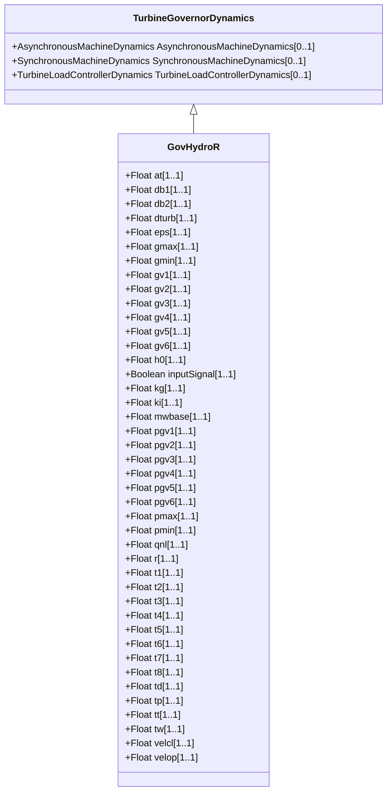

# GovHydroR

Fourth order lead-lag governor and hydro turbine.

## Inheritance

<button class="mermaid-enlarge-button">Enlarge Diagram</button>

## Attributes

| Label | Type | Multiplicity | Comment |
|-------|------|--------------|---------|
| at | Float | 1..1 | Turbine gain (At). Typical value = 1,2. |
| db1 | Float | 1..1 | Intentional dead-band width (db1). Unit = Hz. Typical value = 0. |
| db2 | Float | 1..1 | Unintentional dead-band (db2). Unit = MW. Typical value = 0. |
| dturb | Float | 1..1 | Turbine damping factor (Dturb). Typical value = 0,2. |
| eps | Float | 1..1 | Intentional db hysteresis (eps). Unit = Hz. Typical value = 0. |
| gmax | Float | 1..1 | Maximum governor output (Gmax) (> GovHydroR.gmin). Typical value = 1,05. |
| gmin | Float | 1..1 | Minimum governor output (Gmin) (< GovHydroR.gmax). Typical value = -0,05. |
| gv1 | Float | 1..1 | Nonlinear gain point 1, PU gv (Gv1). Typical value = 0. |
| gv2 | Float | 1..1 | Nonlinear gain point 2, PU gv (Gv2). Typical value = 0. |
| gv3 | Float | 1..1 | Nonlinear gain point 3, PU gv (Gv3). Typical value = 0. |
| gv4 | Float | 1..1 | Nonlinear gain point 4, PU gv (Gv4). Typical value = 0. |
| gv5 | Float | 1..1 | Nonlinear gain point 5, PU gv (Gv5). Typical value = 0. |
| gv6 | Float | 1..1 | Nonlinear gain point 6, PU gv (Gv6). Typical value = 0. |
| h0 | Float | 1..1 | Turbine nominal head (H0). Typical value = 1. |
| inputSignal | Boolean | 1..1 | Input signal switch (Flag). true = Pe input is used false = feedback is received from CV. Flag is normally dependent on Tt. If Tt is zero, Flag is set to false. If Tt is not zero, Flag is set to true. Typical value = true. |
| kg | Float | 1..1 | Gate servo gain (Kg). Typical value = 2. |
| ki | Float | 1..1 | Integral gain (Ki). Typical value = 0,5. |
| mwbase | Float | 1..1 | Base for power values (MWbase) (> 0). Unit = MW. |
| pgv1 | Float | 1..1 | Nonlinear gain point 1, PU power (Pgv1). Typical value = 0. |
| pgv2 | Float | 1..1 | Nonlinear gain point 2, PU power (Pgv2). Typical value = 0. |
| pgv3 | Float | 1..1 | Nonlinear gain point 3, PU power (Pgv3). Typical value = 0. |
| pgv4 | Float | 1..1 | Nonlinear gain point 4, PU power (Pgv4). Typical value = 0. |
| pgv5 | Float | 1..1 | Nonlinear gain point 5, PU power (Pgv5). Typical value = 0. |
| pgv6 | Float | 1..1 | Nonlinear gain point 6, PU power (Pgv6). Typical value = 0. |
| pmax | Float | 1..1 | Maximum gate opening, PU of MWbase (Pmax) (> GovHydroR.pmin). Typical value = 1. |
| pmin | Float | 1..1 | Minimum gate opening, PU of MWbase (Pmin) (< GovHydroR.pmax). Typical value = 0. |
| qnl | Float | 1..1 | No-load turbine flow at nominal head (Qnl). Typical value = 0,08. |
| r | Float | 1..1 | Steady-state droop (R). Typical value = 0,05. |
| t1 | Float | 1..1 | Lead time constant 1 (T1) (>= 0). Typical value = 1,5. |
| t2 | Float | 1..1 | Lag time constant 1 (T2) (>= 0). Typical value = 0,1. |
| t3 | Float | 1..1 | Lead time constant 2 (T3) (>= 0). Typical value = 1,5. |
| t4 | Float | 1..1 | Lag time constant 2 (T4) (>= 0). Typical value = 0,1. |
| t5 | Float | 1..1 | Lead time constant 3 (T5) (>= 0). Typical value = 0. |
| t6 | Float | 1..1 | Lag time constant 3 (T6) (>= 0). Typical value = 0,05. |
| t7 | Float | 1..1 | Lead time constant 4 (T7) (>= 0). Typical value = 0. |
| t8 | Float | 1..1 | Lag time constant 4 (T8) (>= 0). Typical value = 0,05. |
| td | Float | 1..1 | Input filter time constant (Td) (>= 0). Typical value = 0,05. |
| tp | Float | 1..1 | Gate servo time constant (Tp) (>= 0). Typical value = 0,05. |
| tt | Float | 1..1 | Power feedback time constant (Tt) (>= 0). Typical value = 0. |
| tw | Float | 1..1 | Water inertia time constant (Tw) (> 0). Typical value = 1. |
| velcl | Float | 1..1 | Maximum gate closing velocity (Velcl). Unit = PU / s. Typical value = -0,2. |
| velop | Float | 1..1 | Maximum gate opening velocity (Velop). Unit = PU / s. Typical value = 0,2. |

