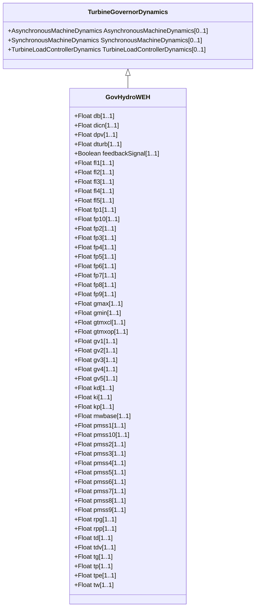

# GovHydroWEH

WoodwardTM electric hydro governor. [Footnote: Woodward electric hydro governors are an example of suitable products available commercially. This information is given for the convenience of users of this document and does not constitute an endorsement by IEC of these products.]

## Inheritance

<button class="mermaid-enlarge-button">Enlarge Diagram</button>

## Attributes

| Label | Type | Multiplicity | Comment |
|-------|------|--------------|---------|
| db | Float | 1..1 | Speed deadband (db). |
| dicn | Float | 1..1 | Value to allow the integral controller to advance beyond the gate limits (Dicn). |
| dpv | Float | 1..1 | Value to allow the pilot valve controller to advance beyond the gate limits (Dpv). |
| dturb | Float | 1..1 | Turbine damping factor (Dturb). Unit = delta P (PU of MWbase) / delta speed (PU). |
| feedbackSignal | Boolean | 1..1 | Feedback signal selection (Sw). true = PID output (if R-Perm-Gate = droop and R-Perm-Pe = 0) false = electrical power (if R-Perm-Gate = 0 and R-Perm-Pe = droop) or false = gate position (if R-Perm-Gate = droop and R-Perm-Pe = 0). Typical value = false. |
| fl1 | Float | 1..1 | Flowgate 1 (Fl1). Flow value for gate position point 1 for lookup table representing water flow through the turbine as a function of gate position to produce steady state flow. |
| fl2 | Float | 1..1 | Flowgate 2 (Fl2). Flow value for gate position point 2 for lookup table representing water flow through the turbine as a function of gate position to produce steady state flow. |
| fl3 | Float | 1..1 | Flowgate 3 (Fl3). Flow value for gate position point 3 for lookup table representing water flow through the turbine as a function of gate position to produce steady state flow. |
| fl4 | Float | 1..1 | Flowgate 4 (Fl4). Flow value for gate position point 4 for lookup table representing water flow through the turbine as a function of gate position to produce steady state flow. |
| fl5 | Float | 1..1 | Flowgate 5 (Fl5). Flow value for gate position point 5 for lookup table representing water flow through the turbine as a function of gate position to produce steady state flow. |
| fp1 | Float | 1..1 | Flow P1 (Fp1). Turbine flow value for point 1 for lookup table representing PU mechanical power on machine MVA rating as a function of turbine flow. |
| fp10 | Float | 1..1 | Flow P10 (Fp10). Turbine flow value for point 10 for lookup table representing PU mechanical power on machine MVA rating as a function of turbine flow. |
| fp2 | Float | 1..1 | Flow P2 (Fp2). Turbine flow value for point 2 for lookup table representing PU mechanical power on machine MVA rating as a function of turbine flow. |
| fp3 | Float | 1..1 | Flow P3 (Fp3). Turbine flow value for point 3 for lookup table representing PU mechanical power on machine MVA rating as a function of turbine flow. |
| fp4 | Float | 1..1 | Flow P4 (Fp4). Turbine flow value for point 4 for lookup table representing PU mechanical power on machine MVA rating as a function of turbine flow. |
| fp5 | Float | 1..1 | Flow P5 (Fp5). Turbine flow value for point 5 for lookup table representing PU mechanical power on machine MVA rating as a function of turbine flow. |
| fp6 | Float | 1..1 | Flow P6 (Fp6). Turbine flow value for point 6 for lookup table representing PU mechanical power on machine MVA rating as a function of turbine flow. |
| fp7 | Float | 1..1 | Flow P7 (Fp7). Turbine flow value for point 7 for lookup table representing PU mechanical power on machine MVA rating as a function of turbine flow. |
| fp8 | Float | 1..1 | Flow P8 (Fp8). Turbine flow value for point 8 for lookup table representing PU mechanical power on machine MVA rating as a function of turbine flow. |
| fp9 | Float | 1..1 | Flow P9 (Fp9). Turbine flow value for point 9 for lookup table representing PU mechanical power on machine MVA rating as a function of turbine flow. |
| gmax | Float | 1..1 | Maximum gate position (Gmax) (> GovHydroWEH.gmin). |
| gmin | Float | 1..1 | Minimum gate position (Gmin) (< GovHydroWEH.gmax). |
| gtmxcl | Float | 1..1 | Maximum gate closing rate (Gtmxcl). |
| gtmxop | Float | 1..1 | Maximum gate opening rate (Gtmxop). |
| gv1 | Float | 1..1 | Gate 1 (Gv1). Gate Position value for point 1 for lookup table representing water flow through the turbine as a function of gate position to produce steady state flow. |
| gv2 | Float | 1..1 | Gate 2 (Gv2). Gate Position value for point 2 for lookup table representing water flow through the turbine as a function of gate position to produce steady state flow. |
| gv3 | Float | 1..1 | Gate 3 (Gv3). Gate Position value for point 3 for lookup table representing water flow through the turbine as a function of gate position to produce steady state flow. |
| gv4 | Float | 1..1 | Gate 4 (Gv4). Gate Position value for point 4 for lookup table representing water flow through the turbine as a function of gate position to produce steady state flow. |
| gv5 | Float | 1..1 | Gate 5 (Gv5). Gate Position value for point 5 for lookup table representing water flow through the turbine as a function of gate position to produce steady state flow. |
| kd | Float | 1..1 | Derivative controller derivative gain (Kd). |
| ki | Float | 1..1 | Derivative controller Integral gain (Ki). |
| kp | Float | 1..1 | Derivative control gain (Kp). |
| mwbase | Float | 1..1 | Base for power values (MWbase) (> 0). Unit = MW. |
| pmss1 | Float | 1..1 | Pmss flow P1 (Pmss1). Mechanical power output for turbine flow point 1 for lookup table representing PU mechanical power on machine MVA rating as a function of turbine flow. |
| pmss10 | Float | 1..1 | Pmss flow P10 (Pmss10). Mechanical power output for turbine flow point 10 for lookup table representing PU mechanical power on machine MVA rating as a function of turbine flow. |
| pmss2 | Float | 1..1 | Pmss flow P2 (Pmss2). Mechanical power output for turbine flow point 2 for lookup table representing PU mechanical power on machine MVA rating as a function of turbine flow. |
| pmss3 | Float | 1..1 | Pmss flow P3 (Pmss3). Mechanical power output for turbine flow point 3 for lookup table representing PU mechanical power on machine MVA rating as a function of turbine flow. |
| pmss4 | Float | 1..1 | Pmss flow P4 (Pmss4). Mechanical power output for turbine flow point 4 for lookup table representing PU mechanical power on machine MVA rating as a function of turbine flow. |
| pmss5 | Float | 1..1 | Pmss flow P5 (Pmss5). Mechanical power output for turbine flow point 5 for lookup table representing PU mechanical power on machine MVA rating as a function of turbine flow. |
| pmss6 | Float | 1..1 | Pmss flow P6 (Pmss6). Mechanical power output for turbine flow point 6 for lookup table representing PU mechanical power on machine MVA rating as a function of turbine flow. |
| pmss7 | Float | 1..1 | Pmss flow P7 (Pmss7). Mechanical power output for turbine flow point 7 for lookup table representing PU mechanical power on machine MVA rating as a function of turbine flow. |
| pmss8 | Float | 1..1 | Pmss flow P8 (Pmss8). Mechanical power output for turbine flow point 8 for lookup table representing PU mechanical power on machine MVA rating as a function of turbine flow. |
| pmss9 | Float | 1..1 | Pmss flow P9 (Pmss9). Mechanical power output for turbine flow point 9 for lookup table representing PU mechanical power on machine MVA rating as a function of turbine flow. |
| rpg | Float | 1..1 | Permanent droop for governor output feedback (R-Perm-Gate). |
| rpp | Float | 1..1 | Permanent droop for electrical power feedback (R-Perm-Pe). |
| td | Float | 1..1 | Derivative controller time constant (Td) (>= 0). Limits the derivative characteristic beyond a breakdown frequency to avoid amplification of high-frequency noise. |
| tdv | Float | 1..1 | Distributive valve time lag time constant (Tdv) (>= 0). |
| tg | Float | 1..1 | Value to allow the distribution valve controller to advance beyond the gate movement rate limit (Tg) (>= 0). |
| tp | Float | 1..1 | Pilot valve time lag time constant (Tp) (>= 0). |
| tpe | Float | 1..1 | Electrical power droop time constant (Tpe) (>= 0). |
| tw | Float | 1..1 | Water inertia time constant (Tw) (> 0). |

