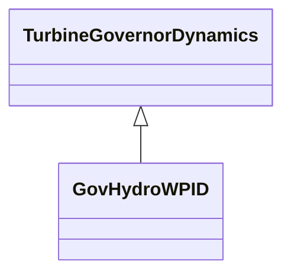

# GovHydroWPID

WoodwardTM PID hydro governor. [Footnote: Woodward PID hydro governors are an example of suitable products available commercially. This information is given for the convenience of users of this document and does not constitute an endorsement by IEC of these products.]

## Inheritance

<button class="mermaid-enlarge-button">Enlarge Diagram</button>

## Attributes

| Label | Type | Multiplicity | Comment |
|-------|------|--------------|---------|
| d | Float | 1..1 | Turbine damping factor (D). Unit = delta P / delta speed. |
| gatmax | Float | 1..1 | Gate opening limit maximum (Gatmax) (> GovHydroWPID.gatmin). |
| gatmin | Float | 1..1 | Gate opening limit minimum (Gatmin) (< GovHydroWPID.gatmax). |
| gv1 | Float | 1..1 | Gate position 1 (Gv1). |
| gv2 | Float | 1..1 | Gate position 2 (Gv2). |
| gv3 | Float | 1..1 | Gate position 3 (Gv3) (= 1,0). |
| kd | Float | 1..1 | Derivative gain (Kd). Typical value = 1,11. |
| ki | Float | 1..1 | Reset gain (Ki). Typical value = 0,36. |
| kp | Float | 1..1 | Proportional gain (Kp). Typical value = 0,1. |
| mwbase | Float | 1..1 | Base for power values (MWbase) (> 0). Unit = MW. |
| pgv1 | Float | 1..1 | Output at Gv1 PU of MWbase (Pgv1). |
| pgv2 | Float | 1..1 | Output at Gv2 PU of MWbase (Pgv2). |
| pgv3 | Float | 1..1 | Output at Gv3 PU of MWbase (Pgv3). |
| pmax | Float | 1..1 | Maximum power output (Pmax) (> GovHydroWPID.pmin). |
| pmin | Float | 1..1 | Minimum power output (Pmin) (< GovHydroWPID.pmax). |
| reg | Float | 1..1 | Permanent drop (Reg). |
| ta | Float | 1..1 | Controller time constant (Ta) (>= 0). Typical value = 0. |
| tb | Float | 1..1 | Gate servo time constant (Tb) (>= 0). Typical value = 0. |
| treg | Float | 1..1 | Speed detector time constant (Treg) (>= 0). |
| tw | Float | 1..1 | Water inertia time constant (Tw) (>= 0). Typical value = 0. |
| velmax | Float | 1..1 | Maximum gate opening velocity (Velmax) (> GovHydroWPID.velmin). Unit = PU / s. Typical value = 0. |
| velmin | Float | 1..1 | Maximum gate closing velocity (Velmin) (< GovHydroWPID.velmax). Unit = PU / s. Typical value = 0. |

