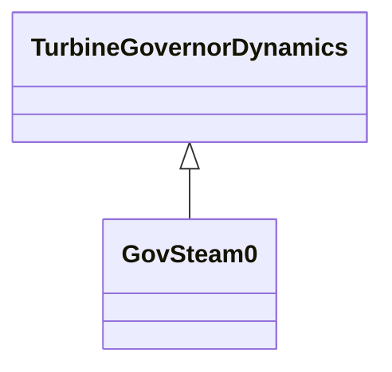

# GovSteam0

A simplified steam turbine governor.

## Inheritance

<button class="mermaid-enlarge-button">Enlarge Diagram</button>

## Attributes

| Label | Type | Multiplicity | Comment |
|-------|------|--------------|---------|
| dt | Float | 1..1 | Turbine damping coefficient (Dt). Unit = delta P / delta speed. Typical value = 0. |
| mwbase | Float | 1..1 | Base for power values (MWbase) (> 0). Unit = MW. |
| r | Float | 1..1 | Permanent droop (R). Typical value = 0,05. |
| t1 | Float | 1..1 | Steam bowl time constant (T1) (> 0). Typical value = 0,5. |
| t2 | Float | 1..1 | Numerator time constant of T2/T3 block (T2) (>= 0). Typical value = 3. |
| t3 | Float | 1..1 | Reheater time constant (T3) (> 0). Typical value = 10. |
| vmax | Float | 1..1 | Maximum valve position, PU of mwcap (Vmax) (> GovSteam0.vmin). Typical value = 1. |
| vmin | Float | 1..1 | Minimum valve position, PU of mwcap (Vmin) (< GovSteam0.vmax). Typical value = 0. |

