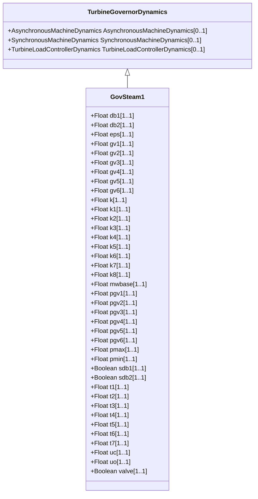

# GovSteam1

Steam turbine governor, based on the GovSteamIEEE1 (with optional deadband and nonlinear valve gain added).

## Inheritance

<button class="mermaid-enlarge-button">Enlarge Diagram</button>

## Attributes

| Label | Type | Multiplicity | Comment |
|-------|------|--------------|---------|
| db1 | Float | 1..1 | Intentional deadband width (db1). Unit = Hz. Typical value = 0. |
| db2 | Float | 1..1 | Unintentional deadband (db2). Unit = MW. Typical value = 0. |
| eps | Float | 1..1 | Intentional db hysteresis (eps). Unit = Hz. Typical value = 0. |
| gv1 | Float | 1..1 | Nonlinear gain valve position point 1 (GV1). Typical value = 0. |
| gv2 | Float | 1..1 | Nonlinear gain valve position point 2 (GV2). Typical value = 0,4. |
| gv3 | Float | 1..1 | Nonlinear gain valve position point 3 (GV3). Typical value = 0,5. |
| gv4 | Float | 1..1 | Nonlinear gain valve position point 4 (GV4). Typical value = 0,6. |
| gv5 | Float | 1..1 | Nonlinear gain valve position point 5 (GV5). Typical value = 1. |
| gv6 | Float | 1..1 | Nonlinear gain valve position point 6 (GV6). Typical value = 0. |
| k | Float | 1..1 | Governor gain (reciprocal of droop) (K) (> 0). Typical value = 25. |
| k1 | Float | 1..1 | Fraction of HP shaft power after first boiler pass (K1). Typical value = 0,2. |
| k2 | Float | 1..1 | Fraction of LP shaft power after first boiler pass (K2). Typical value = 0. |
| k3 | Float | 1..1 | Fraction of HP shaft power after second boiler pass (K3). Typical value = 0,3. |
| k4 | Float | 1..1 | Fraction of LP shaft power after second boiler pass (K4). Typical value = 0. |
| k5 | Float | 1..1 | Fraction of HP shaft power after third boiler pass (K5). Typical value = 0,5. |
| k6 | Float | 1..1 | Fraction of LP shaft power after third boiler pass (K6). Typical value = 0. |
| k7 | Float | 1..1 | Fraction of HP shaft power after fourth boiler pass (K7). Typical value = 0. |
| k8 | Float | 1..1 | Fraction of LP shaft power after fourth boiler pass (K8). Typical value = 0. |
| mwbase | Float | 1..1 | Base for power values (MWbase) (> 0). Unit = MW. |
| pgv1 | Float | 1..1 | Nonlinear gain power value point 1 (Pgv1). Typical value = 0. |
| pgv2 | Float | 1..1 | Nonlinear gain power value point 2 (Pgv2). Typical value = 0,75. |
| pgv3 | Float | 1..1 | Nonlinear gain power value point 3 (Pgv3). Typical value = 0,91. |
| pgv4 | Float | 1..1 | Nonlinear gain power value point 4 (Pgv4). Typical value = 0,98. |
| pgv5 | Float | 1..1 | Nonlinear gain power value point 5 (Pgv5). Typical value = 1. |
| pgv6 | Float | 1..1 | Nonlinear gain power value point 6 (Pgv6). Typical value = 0. |
| pmax | Float | 1..1 | Maximum valve opening (Pmax) (> GovSteam1.pmin). Typical value = 1. |
| pmin | Float | 1..1 | Minimum valve opening (Pmin) (>= 0 and < GovSteam1.pmax). Typical value = 0. |
| sdb1 | Boolean | 1..1 | Intentional deadband indicator. true = intentional deadband is applied false = intentional deadband is not applied. Typical value = true. |
| sdb2 | Boolean | 1..1 | Unintentional deadband location. true = intentional deadband is applied before point 'A' false = intentional deadband is applied after point 'A'. Typical value = true. |
| t1 | Float | 1..1 | Governor lag time constant (T1) (>= 0). Typical value = 0. |
| t2 | Float | 1..1 | Governor lead time constant (T2) (>= 0). Typical value = 0. |
| t3 | Float | 1..1 | Valve positioner time constant (T3) (> 0). Typical value = 0,1. |
| t4 | Float | 1..1 | Inlet piping/steam bowl time constant (T4) (>= 0). Typical value = 0,3. |
| t5 | Float | 1..1 | Time constant of second boiler pass (T5) (>= 0). Typical value = 5. |
| t6 | Float | 1..1 | Time constant of third boiler pass (T6) (>= 0). Typical value = 0,5. |
| t7 | Float | 1..1 | Time constant of fourth boiler pass (T7) (>= 0). Typical value = 0. |
| uc | Float | 1..1 | Maximum valve closing velocity (Uc) (< 0). Unit = PU / s. Typical value = -10. |
| uo | Float | 1..1 | Maximum valve opening velocity (Uo) (> 0). Unit = PU / s. Typical value = 1. |
| valve | Boolean | 1..1 | Nonlinear valve characteristic. true = nonlinear valve characteristic is used false = nonlinear valve characteristic is not used. Typical value = true. |

