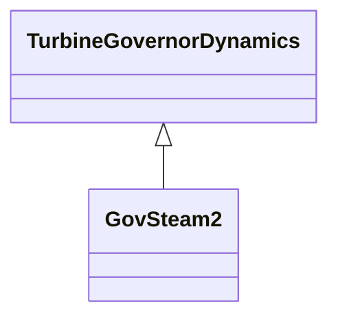

# GovSteam2

Simplified governor.

## Inheritance

<button class="mermaid-enlarge-button">Enlarge Diagram</button>

## Attributes

| Label | Type | Multiplicity | Comment |
|-------|------|--------------|---------|
| dbf | Float | 1..1 | Frequency deadband (DBF). Typical value = 0. |
| k | Float | 1..1 | Governor gain (reciprocal of droop) (K). Typical value = 20. |
| mnef | Float | 1..1 | Fuel flow maximum negative error value (MNEF). Typical value = -1. |
| mxef | Float | 1..1 | Fuel flow maximum positive error value (MXEF). Typical value = 1. |
| pmax | Float | 1..1 | Maximum fuel flow (PMAX) (> GovSteam2.pmin). Typical value = 1. |
| pmin | Float | 1..1 | Minimum fuel flow (PMIN) (< GovSteam2.pmax). Typical value = 0. |
| t1 | Float | 1..1 | Governor lag time constant (T1) (> 0). Typical value = 0,45. |
| t2 | Float | 1..1 | Governor lead time constant (T2) (>= 0). Typical value = 0. |

