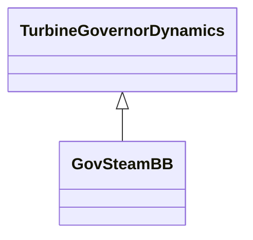

# GovSteamBB

European governor model.

## Inheritance

<button class="mermaid-enlarge-button">Enlarge Diagram</button>

## Attributes

| Label | Type | Multiplicity | Comment |
|-------|------|--------------|---------|
| fcut | Float | 1..1 | Frequency deadband (fcut) (>= 0). Typical value = 0,002. |
| k2 | Float | 1..1 | Gain (K2). Typical value = 0,75. |
| k3 | Float | 1..1 | Gain (K3). Typical value = 0,5. |
| kd | Float | 1..1 | Gain (Kd). Typical value = 1,0. |
| kg | Float | 1..1 | Gain (Kg). Typical value = 1,0. |
| kls | Float | 1..1 | Gain (Kls) (> 0). Typical value = 0,1. |
| kp | Float | 1..1 | Gain (Kp). Typical value = 1,0. |
| ks | Float | 1..1 | Gain (Ks). Typical value = 21,0. |
| peflag | Boolean | 1..1 | Electric power input selection (Peflag). true = electric power input false = feedback signal. Typical value = false. |
| pmax | Float | 1..1 | High power limit (Pmax) (> GovSteamBB.pmin). Typical value = 1,0. |
| pmin | Float | 1..1 | Low power limit (Pmin) (< GovSteamBB.pmax). Typical value = 0. |
| t1 | Float | 1..1 | Time constant (T1). Typical value = 0,05. |
| t4 | Float | 1..1 | Time constant (T4). Typical value = 0,15. |
| t5 | Float | 1..1 | Time constant (T5). Typical value = 12,0. |
| t6 | Float | 1..1 | Time constant (T6). Typical value = 0,75. |
| td | Float | 1..1 | Time constant (Td) (> 0). Typical value = 1,0. |
| tn | Float | 1..1 | Time constant (Tn) (> 0). Typical value = 1,0. |

