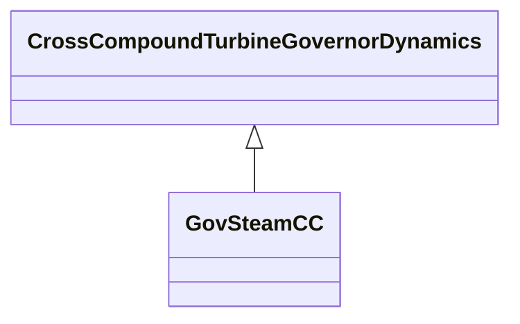

# GovSteamCC

Cross compound turbine governor. Unlike tandem compound units, cross compound units are not on the same shaft.

## Inheritance

<button class="mermaid-enlarge-button">Enlarge Diagram</button>

## Attributes

| Label | Type | Multiplicity | Comment |
|-------|------|--------------|---------|
| dhp | Float | 1..1 | HP damping factor (Dhp). Typical value = 0. |
| dlp | Float | 1..1 | LP damping factor (Dlp). Typical value = 0. |
| fhp | Float | 1..1 | Fraction of HP power ahead of reheater (Fhp). Typical value = 0,3. |
| flp | Float | 1..1 | Fraction of LP power ahead of reheater (Flp). Typical value = 0,7. |
| mwbase | Float | 1..1 | Base for power values (MWbase) (> 0). Unit = MW. |
| pmaxhp | Float | 1..1 | Maximum HP value position (Pmaxhp). Typical value = 1. |
| pmaxlp | Float | 1..1 | Maximum LP value position (Pmaxlp). Typical value = 1. |
| rhp | Float | 1..1 | HP governor droop (Rhp) (> 0). Typical value = 0,05. |
| rlp | Float | 1..1 | LP governor droop (Rlp) (> 0). Typical value = 0,05. |
| t1hp | Float | 1..1 | HP governor time constant (T1hp) (>= 0). Typical value = 0,1. |
| t1lp | Float | 1..1 | LP governor time constant (T1lp) (>= 0). Typical value = 0,1. |
| t3hp | Float | 1..1 | HP turbine time constant (T3hp) (>= 0). Typical value = 0,1. |
| t3lp | Float | 1..1 | LP turbine time constant (T3lp) (>= 0). Typical value = 0,1. |
| t4hp | Float | 1..1 | HP turbine time constant (T4hp) (>= 0). Typical value = 0,1. |
| t4lp | Float | 1..1 | LP turbine time constant (T4lp) (>= 0). Typical value = 0,1. |
| t5hp | Float | 1..1 | HP reheater time constant (T5hp) (>= 0). Typical value = 10. |
| t5lp | Float | 1..1 | LP reheater time constant (T5lp) (>= 0). Typical value = 10. |

