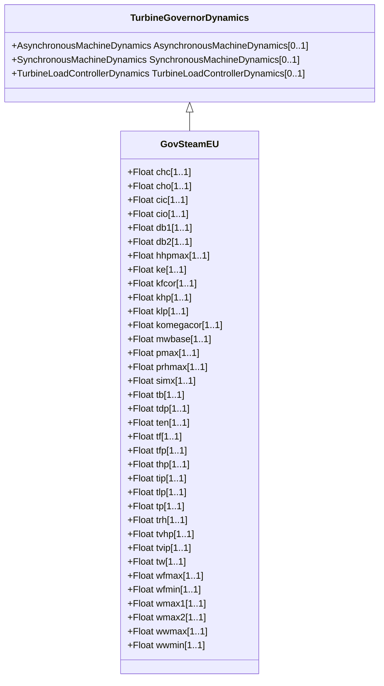

# GovSteamEU

Simplified boiler and steam turbine with PID governor.

## Inheritance

<button class="mermaid-enlarge-button">Enlarge Diagram</button>

## Attributes

| Label | Type | Multiplicity | Comment |
|-------|------|--------------|---------|
| chc | Float | 1..1 | Control valves rate closing limit (Chc). Unit = PU / s. Typical value = -3,3. |
| cho | Float | 1..1 | Control valves rate opening limit (Cho). Unit = PU / s. Typical value = 0,17. |
| cic | Float | 1..1 | Intercept valves rate closing limit (Cic). Typical value = -2,2. |
| cio | Float | 1..1 | Intercept valves rate opening limit (Cio). Typical value = 0,123. |
| db1 | Float | 1..1 | Deadband of the frequency corrector (db1). Typical value = 0. |
| db2 | Float | 1..1 | Deadband of the speed governor (db2). Typical value = 0,0004. |
| hhpmax | Float | 1..1 | Maximum control valve position (Hhpmax). Typical value = 1. |
| ke | Float | 1..1 | Gain of the power controller (Ke). Typical value = 0,65. |
| kfcor | Float | 1..1 | Gain of the frequency corrector (Kfcor). Typical value = 20. |
| khp | Float | 1..1 | Fraction of total turbine output generated by HP part (Khp). Typical value = 0,277. |
| klp | Float | 1..1 | Fraction of total turbine output generated by HP part (Klp). Typical value = 0,723. |
| komegacor | Float | 1..1 | Gain of the speed governor (Kwcor). Typical value = 20. |
| mwbase | Float | 1..1 | Base for power values (MWbase) (> 0). Unit = MW. |
| pmax | Float | 1..1 | Maximal active power of the turbine (Pmax). Typical value = 1. |
| prhmax | Float | 1..1 | Maximum low pressure limit (Prhmax). Typical value = 1,4. |
| simx | Float | 1..1 | Intercept valves transfer limit (Simx). Typical value = 0,425. |
| tb | Float | 1..1 | Boiler time constant (Tb) (>= 0). Typical value = 100. |
| tdp | Float | 1..1 | Derivative time constant of the power controller (Tdp) (>= 0). Typical value = 0. |
| ten | Float | 1..1 | Electro hydraulic transducer (Ten) (>= 0). Typical value = 0,1. |
| tf | Float | 1..1 | Frequency transducer time constant (Tf) (>= 0). Typical value = 0. |
| tfp | Float | 1..1 | Time constant of the power controller (Tfp) (>= 0). Typical value = 0. |
| thp | Float | 1..1 | High pressure (HP) time constant of the turbine (Thp) (>= 0). Typical value = 0,31. |
| tip | Float | 1..1 | Integral time constant of the power controller (Tip) (>= 0). Typical value = 2. |
| tlp | Float | 1..1 | Low pressure (LP) time constant of the turbine (Tlp) (>= 0). Typical value = 0,45. |
| tp | Float | 1..1 | Power transducer time constant (Tp) (>= 0). Typical value = 0,07. |
| trh | Float | 1..1 | Reheater time constant of the turbine (Trh) (>= 0). Typical value = 8. |
| tvhp | Float | 1..1 | Control valves servo time constant (Tvhp) (>= 0). Typical value = 0,1. |
| tvip | Float | 1..1 | Intercept valves servo time constant (Tvip) (>= 0). Typical value = 0,15. |
| tw | Float | 1..1 | Speed transducer time constant (Tw) (>= 0). Typical value = 0,02. |
| wfmax | Float | 1..1 | Upper limit for frequency correction (Wfmax) (> GovSteamEU.wfmin). Typical value = 0,05. |
| wfmin | Float | 1..1 | Lower limit for frequency correction (Wfmin) (< GovSteamEU.wfmax). Typical value = -0,05. |
| wmax1 | Float | 1..1 | Emergency speed control lower limit (wmax1). Typical value = 1,025. |
| wmax2 | Float | 1..1 | Emergency speed control upper limit (wmax2). Typical value = 1,05. |
| wwmax | Float | 1..1 | Upper limit for the speed governor (Wwmax) (> GovSteamEU.wwmin). Typical value = 0,1. |
| wwmin | Float | 1..1 | Lower limit for the speed governor frequency correction (Wwmin) (< GovSteamEU.wwmax). Typical value = -1. |

