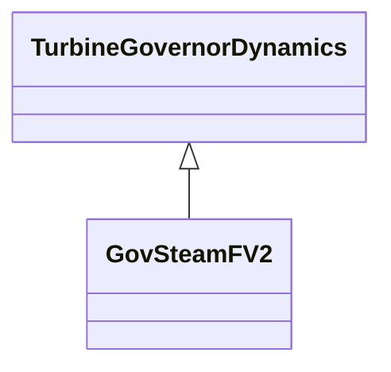

# GovSteamFV2

Steam turbine governor with reheat time constants and modelling of the effects of fast valve closing to reduce mechanical power.

## Inheritance

<button class="mermaid-enlarge-button">Enlarge Diagram</button>

## Attributes

| Label | Type | Multiplicity | Comment |
|-------|------|--------------|---------|
| dt | Float | 1..1 | (Dt). |
| k | Float | 1..1 | Fraction of the turbine power developed by turbine sections not involved in fast valving (K). |
| mwbase | Float | 1..1 | Alternate base used instead of machine base in equipment model if necessary (MWbase) (> 0). Unit = MW. |
| r | Float | 1..1 | (R). |
| t1 | Float | 1..1 | Governor time constant (T1) (>= 0). |
| t3 | Float | 1..1 | Reheater time constant (T3) (>= 0). |
| ta | Float | 1..1 | Time after initial time for valve to close (Ta) (>= 0). |
| tb | Float | 1..1 | Time after initial time for valve to begin opening (Tb) (>= 0). |
| tc | Float | 1..1 | Time after initial time for valve to become fully open (Tc) (>= 0). |
| tt | Float | 1..1 | Time constant with which power falls off after intercept valve closure (Tt) (>= 0). |
| vmax | Float | 1..1 | (Vmax) (> GovSteamFV2.vmin). |
| vmin | Float | 1..1 | (Vmin) (< GovSteamFV2.vmax). |

