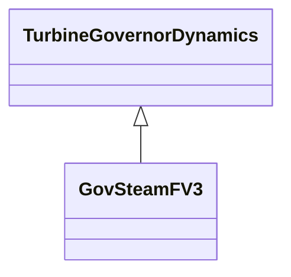

# GovSteamFV3

Simplified GovSteamIEEE1 steam turbine governor with Prmax limit and fast valving.

## Inheritance

<button class="mermaid-enlarge-button">Enlarge Diagram</button>

## Attributes

| Label | Type | Multiplicity | Comment |
|-------|------|--------------|---------|
| gv1 | Float | 1..1 | Nonlinear gain valve position point 1 (GV1). Typical value = 0. |
| gv2 | Float | 1..1 | Nonlinear gain valve position point 2 (GV2). Typical value = 0,4. |
| gv3 | Float | 1..1 | Nonlinear gain valve position point 3 (GV3). Typical value = 0,5. |
| gv4 | Float | 1..1 | Nonlinear gain valve position point 4 (GV4). Typical value = 0,6. |
| gv5 | Float | 1..1 | Nonlinear gain valve position point 5 (GV5). Typical value = 1. |
| gv6 | Float | 1..1 | Nonlinear gain valve position point 6 (GV6). Typical value = 0. |
| k | Float | 1..1 | Governor gain, (reciprocal of droop) (K). Typical value = 20. |
| k1 | Float | 1..1 | Fraction of turbine power developed after first boiler pass (K1). Typical value = 0,2. |
| k2 | Float | 1..1 | Fraction of turbine power developed after second boiler pass (K2). Typical value = 0,2. |
| k3 | Float | 1..1 | Fraction of hp turbine power developed after crossover or third boiler pass (K3). Typical value = 0,6. |
| mwbase | Float | 1..1 | Base for power values (MWbase) (> 0). Unit = MW. |
| pgv1 | Float | 1..1 | Nonlinear gain power value point 1 (Pgv1). Typical value = 0. |
| pgv2 | Float | 1..1 | Nonlinear gain power value point 2 (Pgv2). Typical value = 0,75. |
| pgv3 | Float | 1..1 | Nonlinear gain power value point 3 (Pgv3). Typical value = 0,91. |
| pgv4 | Float | 1..1 | Nonlinear gain power value point 4 (Pgv4). Typical value = 0,98. |
| pgv5 | Float | 1..1 | Nonlinear gain power value point 5 (Pgv5). Typical value = 1. |
| pgv6 | Float | 1..1 | Nonlinear gain power value point 6 (Pgv6). Typical value = 0. |
| pmax | Float | 1..1 | Maximum valve opening, PU of MWbase (Pmax) (> GovSteamFV3.pmin). Typical value = 1. |
| pmin | Float | 1..1 | Minimum valve opening, PU of MWbase (Pmin) (< GovSteamFV3.pmax). Typical value = 0. |
| prmax | Float | 1..1 | Max. pressure in reheater (Prmax). Typical value = 1. |
| t1 | Float | 1..1 | Governor lead time constant (T1) (>= 0). Typical value = 0. |
| t2 | Float | 1..1 | Governor lag time constant (T2) (>= 0). Typical value = 0. |
| t3 | Float | 1..1 | Valve positioner time constant (T3) (> 0). Typical value = 0. |
| t4 | Float | 1..1 | Inlet piping/steam bowl time constant (T4) (>= 0). Typical value = 0,2. |
| t5 | Float | 1..1 | Time constant of second boiler pass (i.e. reheater) (T5) (> 0 if fast valving is used, otherwise >= 0). Typical value = 0,5. |
| t6 | Float | 1..1 | Time constant of crossover or third boiler pass (T6) (>= 0). Typical value = 10. |
| ta | Float | 1..1 | Time to close intercept valve (IV) (Ta) (>= 0). Typical value = 0,97. |
| tb | Float | 1..1 | Time until IV starts to reopen (Tb) (>= 0). Typical value = 0,98. |
| tc | Float | 1..1 | Time until IV is fully open (Tc) (>= 0). Typical value = 0,99. |
| uc | Float | 1..1 | Maximum valve closing velocity (Uc). Unit = PU / s. Typical value = -1. |
| uo | Float | 1..1 | Maximum valve opening velocity (Uo). Unit = PU / s. Typical value = 0,1. |

