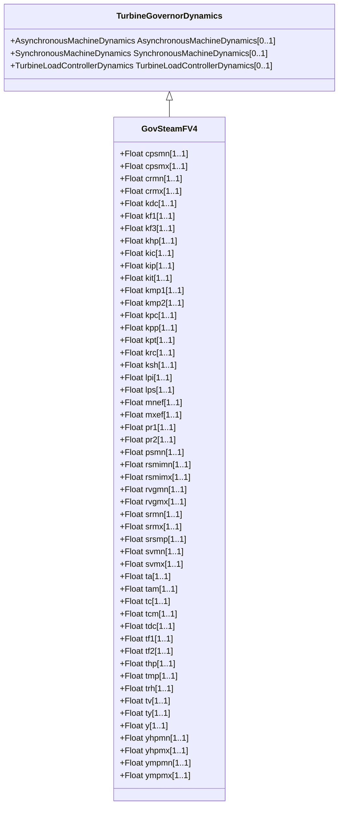

# GovSteamFV4

Detailed electro-hydraulic governor for steam unit.

## Inheritance

<button class="mermaid-enlarge-button">Enlarge Diagram</button>

## Attributes

| Label | Type | Multiplicity | Comment |
|-------|------|--------------|---------|
| cpsmn | Float | 1..1 | Minimum value of pressure regulator output (Cpsmn). Typical value = -1. |
| cpsmx | Float | 1..1 | Maximum value of pressure regulator output (Cpsmx). Typical value = 1. |
| crmn | Float | 1..1 | Minimum value of regulator set-point (Crmn). Typical value = 0. |
| crmx | Float | 1..1 | Maximum value of regulator set-point (Crmx). Typical value = 1,2. |
| kdc | Float | 1..1 | Derivative gain of pressure regulator (Kdc). Typical value = 1. |
| kf1 | Float | 1..1 | Frequency bias (reciprocal of droop) (Kf1). Typical value = 20. |
| kf3 | Float | 1..1 | Frequency control (reciprocal of droop) (Kf3). Typical value = 20. |
| khp | Float | 1..1 | Fraction of total turbine output generated by HP part (Khp). Typical value = 0,35. |
| kic | Float | 1..1 | Integral gain of pressure regulator (Kic). Typical value = 0,0033. |
| kip | Float | 1..1 | Integral gain of pressure feedback regulator (Kip). Typical value = 0,5. |
| kit | Float | 1..1 | Integral gain of electro-hydraulic regulator (Kit). Typical value = 0,04. |
| kmp1 | Float | 1..1 | First gain coefficient of intercept valves characteristic (Kmp1). Typical value = 0,5. |
| kmp2 | Float | 1..1 | Second gain coefficient of intercept valves characteristic (Kmp2). Typical value = 3,5. |
| kpc | Float | 1..1 | Proportional gain of pressure regulator (Kpc). Typical value = 0,5. |
| kpp | Float | 1..1 | Proportional gain of pressure feedback regulator (Kpp). Typical value = 1. |
| kpt | Float | 1..1 | Proportional gain of electro-hydraulic regulator (Kpt). Typical value = 0,3. |
| krc | Float | 1..1 | Maximum variation of fuel flow (Krc). Typical value = 0,05. |
| ksh | Float | 1..1 | Pressure loss due to flow friction in the boiler tubes (Ksh). Typical value = 0,08. |
| lpi | Float | 1..1 | Maximum negative power error (Lpi). Typical value = -0,15. |
| lps | Float | 1..1 | Maximum positive power error (Lps). Typical value = 0,03. |
| mnef | Float | 1..1 | Lower limit for frequency correction (MNEF). Typical value = -0,05. |
| mxef | Float | 1..1 | Upper limit for frequency correction (MXEF). Typical value = 0,05. |
| pr1 | Float | 1..1 | First value of pressure set point static characteristic (Pr1). Typical value = 0,2. |
| pr2 | Float | 1..1 | Second value of pressure set point static characteristic, corresponding to Ps0 = 1,0 PU (Pr2). Typical value = 0,75. |
| psmn | Float | 1..1 | Minimum value of pressure set point static characteristic (Psmn). Typical value = 1. |
| rsmimn | Float | 1..1 | Minimum value of integral regulator (Rsmimn). Typical value = 0. |
| rsmimx | Float | 1..1 | Maximum value of integral regulator (Rsmimx). Typical value = 1,1. |
| rvgmn | Float | 1..1 | Minimum value of integral regulator (Rvgmn). Typical value = 0. |
| rvgmx | Float | 1..1 | Maximum value of integral regulator (Rvgmx). Typical value = 1,2. |
| srmn | Float | 1..1 | Minimum valve opening (Srmn). Typical value = 0. |
| srmx | Float | 1..1 | Maximum valve opening (Srmx). Typical value = 1,1. |
| srsmp | Float | 1..1 | Intercept valves characteristic discontinuity point (Srsmp). Typical value = 0,43. |
| svmn | Float | 1..1 | Maximum regulator gate closing velocity (Svmn). Typical value = -0,0333. |
| svmx | Float | 1..1 | Maximum regulator gate opening velocity (Svmx). Typical value = 0,0333. |
| ta | Float | 1..1 | Control valves rate opening time (Ta) (>= 0). Typical value = 0,8. |
| tam | Float | 1..1 | Intercept valves rate opening time (Tam) (>= 0). Typical value = 0,8. |
| tc | Float | 1..1 | Control valves rate closing time (Tc) (>= 0). Typical value = 0,5. |
| tcm | Float | 1..1 | Intercept valves rate closing time (Tcm) (>= 0). Typical value = 0,5. |
| tdc | Float | 1..1 | Derivative time constant of pressure regulator (Tdc) (>= 0). Typical value = 90. |
| tf1 | Float | 1..1 | Time constant of fuel regulation (Tf1) (>= 0). Typical value = 10. |
| tf2 | Float | 1..1 | Time constant of steam chest (Tf2) (>= 0). Typical value = 10. |
| thp | Float | 1..1 | High pressure (HP) time constant of the turbine (Thp) (>= 0). Typical value = 0,15. |
| tmp | Float | 1..1 | Low pressure (LP) time constant of the turbine (Tmp) (>= 0). Typical value = 0,4. |
| trh | Float | 1..1 | Reheater time constant of the turbine (Trh) (>= 0). Typical value = 10. |
| tv | Float | 1..1 | Boiler time constant (Tv) (>= 0). Typical value = 60. |
| ty | Float | 1..1 | Control valves servo time constant (Ty) (>= 0). Typical value = 0,1. |
| y | Float | 1..1 | Coefficient of linearized equations of turbine (Stodola formulation) (Y). Typical value = 0,13. |
| yhpmn | Float | 1..1 | Minimum control valve position (Yhpmn). Typical value = 0. |
| yhpmx | Float | 1..1 | Maximum control valve position (Yhpmx). Typical value = 1,1. |
| ympmn | Float | 1..1 | Minimum intercept valve position (Ympmn). Typical value = 0. |
| ympmx | Float | 1..1 | Maximum intercept valve position (Ympmx). Typical value = 1,1. |

