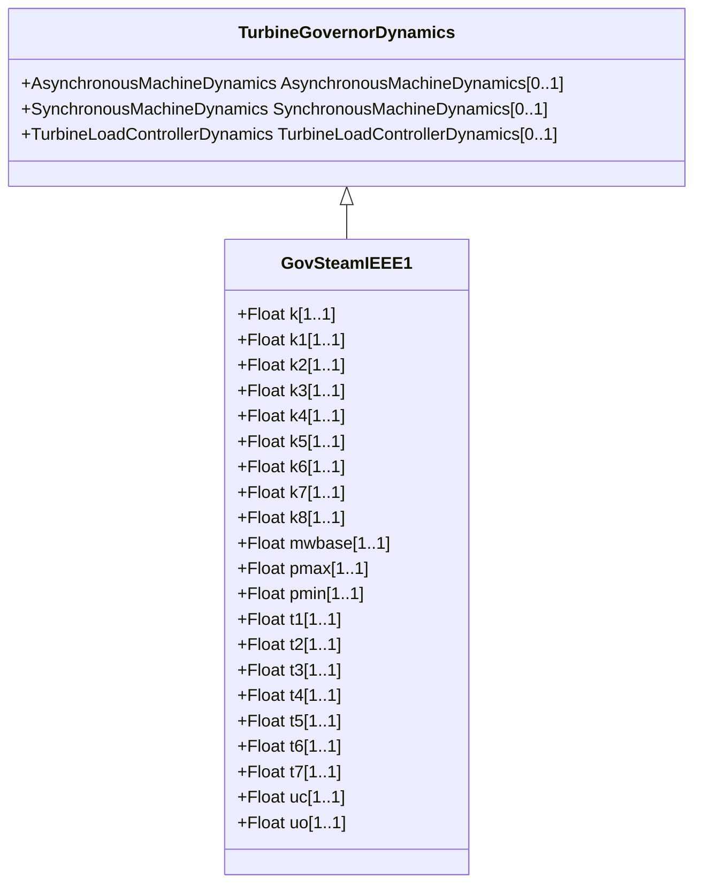

# GovSteamIEEE1

IEEE steam turbine governor model. Reference: IEEE Transactions on Power Apparatus and Systems, November/December 1973, Volume PAS-92, Number 6, Dynamic Models for Steam and Hydro Turbines in Power System Studies, page 1904.

## Inheritance

<button class="mermaid-enlarge-button">Enlarge Diagram</button>

## Attributes

| Label | Type | Multiplicity | Comment |
|-------|------|--------------|---------|
| k | Float | 1..1 | Governor gain (reciprocal of droop) (K) (> 0). Typical value = 25. |
| k1 | Float | 1..1 | Fraction of HP shaft power after first boiler pass (K1). Typical value = 0,2. |
| k2 | Float | 1..1 | Fraction of LP shaft power after first boiler pass (K2). Typical value = 0. |
| k3 | Float | 1..1 | Fraction of HP shaft power after second boiler pass (K3). Typical value = 0,3. |
| k4 | Float | 1..1 | Fraction of LP shaft power after second boiler pass (K4). Typical value = 0. |
| k5 | Float | 1..1 | Fraction of HP shaft power after third boiler pass (K5). Typical value = 0,5. |
| k6 | Float | 1..1 | Fraction of LP shaft power after third boiler pass (K6). Typical value = 0. |
| k7 | Float | 1..1 | Fraction of HP shaft power after fourth boiler pass (K7). Typical value = 0. |
| k8 | Float | 1..1 | Fraction of LP shaft power after fourth boiler pass (K8). Typical value = 0. |
| mwbase | Float | 1..1 | Base for power values (MWbase) (> 0). Unit = MW. |
| pmax | Float | 1..1 | Maximum valve opening (Pmax) (> GovSteamIEEE1.pmin). Typical value = 1. |
| pmin | Float | 1..1 | Minimum valve opening (Pmin) (>= 0 and < GovSteamIEEE1.pmax). Typical value = 0. |
| t1 | Float | 1..1 | Governor lag time constant (T1) (>= 0). Typical value = 0. |
| t2 | Float | 1..1 | Governor lead time constant (T2) (>= 0). Typical value = 0. |
| t3 | Float | 1..1 | Valve positioner time constant (T3) (> 0). Typical value = 0,1. |
| t4 | Float | 1..1 | Inlet piping/steam bowl time constant (T4) (>= 0). Typical value = 0,3. |
| t5 | Float | 1..1 | Time constant of second boiler pass (T5) (>= 0). Typical value = 5. |
| t6 | Float | 1..1 | Time constant of third boiler pass (T6) (>= 0). Typical value = 0,5. |
| t7 | Float | 1..1 | Time constant of fourth boiler pass (T7) (>= 0). Typical value = 0. |
| uc | Float | 1..1 | Maximum valve closing velocity (Uc) (< 0). Unit = PU / s. Typical value = -10. |
| uo | Float | 1..1 | Maximum valve opening velocity (Uo) (> 0). Unit = PU / s. Typical value = 1. |

