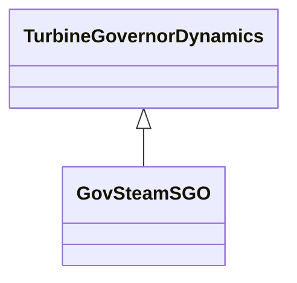

# GovSteamSGO

Simplified steam turbine governor.

## Inheritance

<button class="mermaid-enlarge-button">Enlarge Diagram</button>

## Attributes

| Label | Type | Multiplicity | Comment |
|-------|------|--------------|---------|
| k1 | Float | 1..1 | One / PU regulation (K1). |
| k2 | Float | 1..1 | Fraction (K2). |
| k3 | Float | 1..1 | Fraction (K3). |
| mwbase | Float | 1..1 | Base for power values (MWbase) (> 0). Unit = MW. |
| pmax | Float | 1..1 | Upper power limit (Pmax) (> GovSteamSGO.pmin). |
| pmin | Float | 1..1 | Lower power limit (Pmin) (>= 0 and < GovSteamSGO.pmax). |
| t1 | Float | 1..1 | Controller lag (T1) (>= 0). |
| t2 | Float | 1..1 | Controller lead compensation (T2) (>= 0). |
| t3 | Float | 1..1 | Governor lag (T3) (> 0). |
| t4 | Float | 1..1 | Delay due to steam inlet volumes associated with steam chest and inlet piping (T4) (>= 0). |
| t5 | Float | 1..1 | Reheater delay including hot and cold leads (T5) (>= 0). |
| t6 | Float | 1..1 | Delay due to IP-LP turbine, crossover pipes and LP end hoods (T6) (>= 0). |

