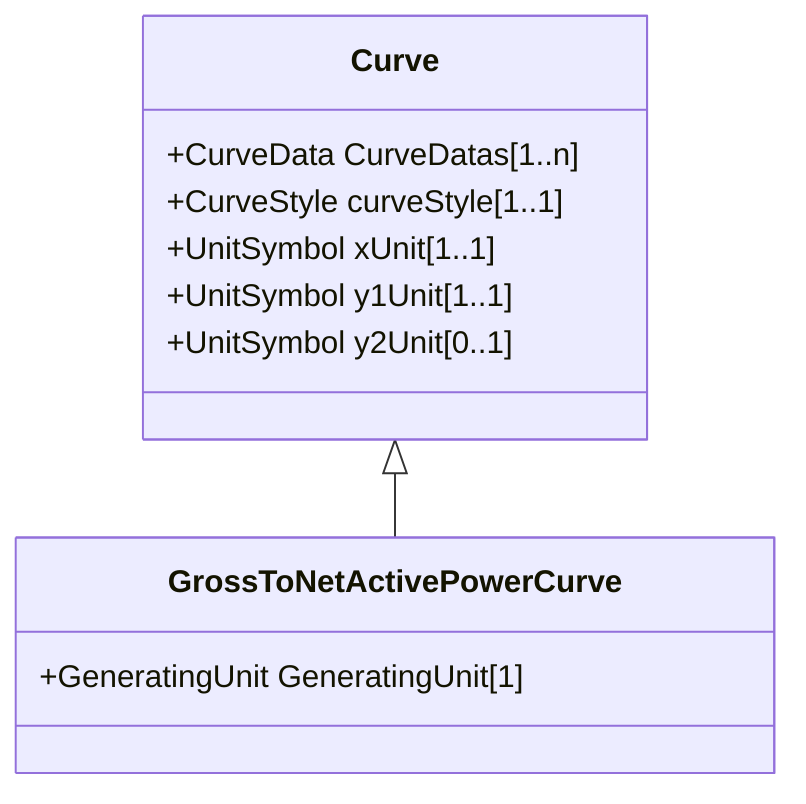

# GrossToNetActivePowerCurve

Relationship between the generating unit's gross active power output on the X-axis (measured at the terminals of the machine(s)) and the generating unit's net active power output on the Y-axis (based on utility-defined measurements at the power station). Station service loads, when modelled, should be treated as non-conforming bus loads. There may be more than one curve, depending on the auxiliary equipment that is in service.

## Inheritance

<button class="mermaid-enlarge-button">Enlarge Diagram</button>

## Attributes

| Label | Type | Multiplicity | Comment |
|-------|------|--------------|---------|
| GeneratingUnit | [GeneratingUnit](GeneratingUnit.md) | 1 | A generating unit may have a gross active power to net active power curve, describing the losses and auxiliary power requirements of the unit. |

