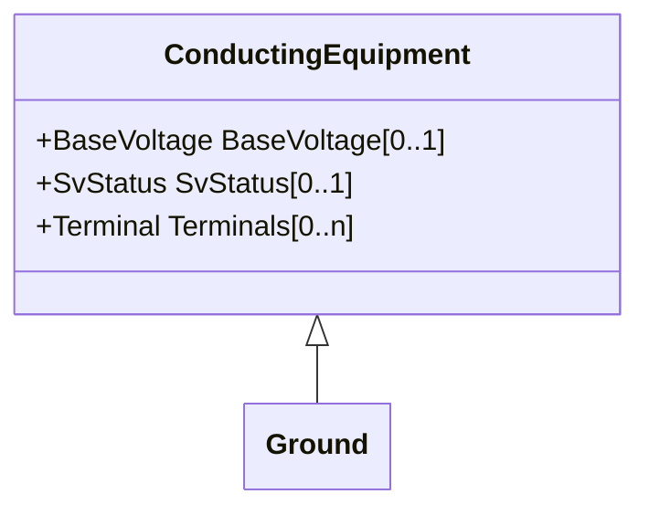

# Ground

A point where the system is grounded used for connecting conducting equipment to ground. The power system model can have any number of grounds.

## Inheritance

<button class="mermaid-enlarge-button">Enlarge Diagram</button>

## Attributes

| Label | Type | Multiplicity | Comment |
|-------|------|--------------|---------|
| No attributes | | | |

