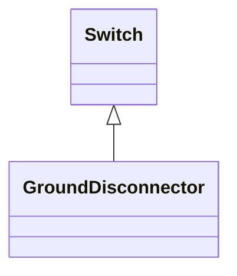

# GroundDisconnector

A manually operated or motor operated mechanical switching device used for isolating a circuit or equipment from ground.

## Inheritance

<button class="mermaid-enlarge-button">Enlarge Diagram</button>

## Attributes

| Label | Type | Multiplicity | Comment |
|-------|------|--------------|---------|
| No attributes | | | |

