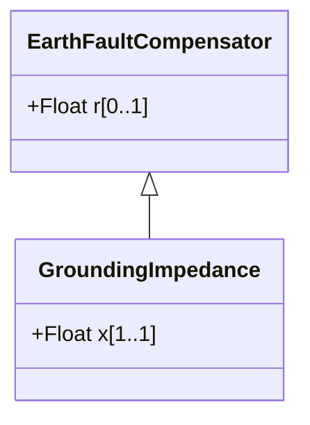

# GroundingImpedance

A fixed impedance device used for grounding.

## Inheritance

<button class="mermaid-enlarge-button">Enlarge Diagram</button>

## Attributes

| Label | Type | Multiplicity | Comment |
|-------|------|--------------|---------|
| x | Float | 1..1 | Reactance of device. |

