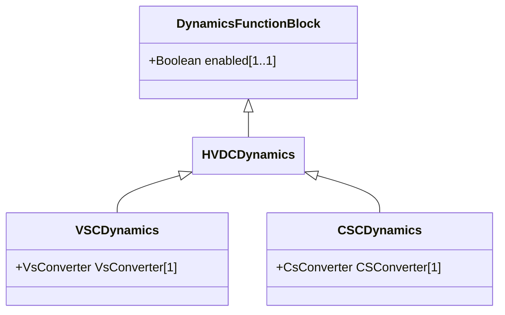

# HVDCDynamics

HVDC whose behaviour is described by reference to a standard model or by definition of a user-defined model.

## Inheritance

<button class="mermaid-enlarge-button">Enlarge Diagram</button>

## Attributes

| Label | Type | Multiplicity | Comment |
|-------|------|--------------|---------|
| No attributes | | | |

