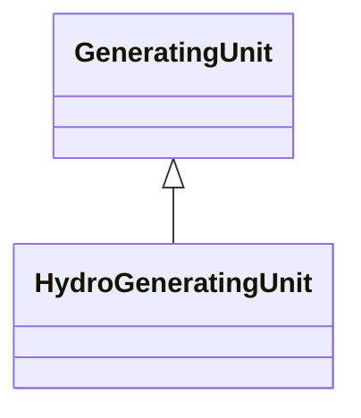

# HydroGeneratingUnit

A generating unit whose prime mover is a hydraulic turbine (e.g., Francis, Pelton, Kaplan).

## Inheritance

<button class="mermaid-enlarge-button">Enlarge Diagram</button>

## Attributes

| Label | Type | Multiplicity | Comment |
|-------|------|--------------|---------|
| HydroPowerPlant | [HydroPowerPlant](HydroPowerPlant.md) | 0..1 | The hydro generating unit belongs to a hydro power plant. |
| dropHeight | Float | 0..1 | The height water drops from the reservoir mid-point to the turbine. |
| energyConversionCapability | [HydroEnergyConversionKind](HydroEnergyConversionKind.md) | 0..1 | Energy conversion capability for generating. |
| turbineType | [HydroTurbineKind](HydroTurbineKind.md) | 0..1 | Type of turbine. |

