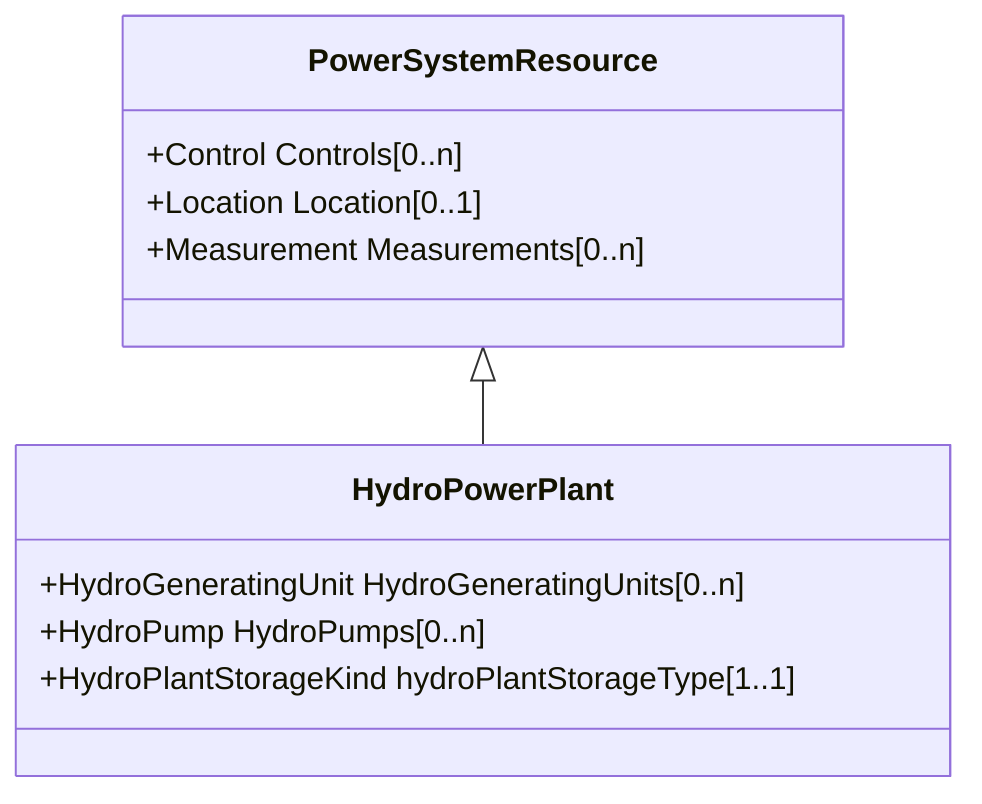

# HydroPowerPlant

A hydro power station which can generate or pump. When generating, the generator turbines receive water from an upper reservoir. When pumping, the pumps receive their water from a lower reservoir.

## Inheritance

<button class="mermaid-enlarge-button">Enlarge Diagram</button>

## Attributes

| Label | Type | Multiplicity | Comment |
|-------|------|--------------|---------|
| HydroGeneratingUnits | [HydroGeneratingUnit](HydroGeneratingUnit.md) | 0..n | The hydro generating unit belongs to a hydro power plant. |
| HydroPumps | [HydroPump](HydroPump.md) | 0..n | The hydro pump may be a member of a pumped storage plant or a pump for distributing water. |
| hydroPlantStorageType | [HydroPlantStorageKind](HydroPlantStorageKind.md) | 1..1 | The type of hydro power plant water storage. |

