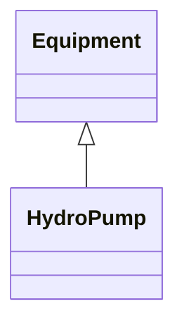

# HydroPump

A synchronous motor-driven pump, typically associated with a pumped storage plant.

## Inheritance

<button class="mermaid-enlarge-button">Enlarge Diagram</button>

## Attributes

| Label | Type | Multiplicity | Comment |
|-------|------|--------------|---------|
| HydroPowerPlant | [HydroPowerPlant](HydroPowerPlant.md) | 0..1 | The hydro pump may be a member of a pumped storage plant or a pump for distributing water. |
| RotatingMachine | [RotatingMachine](RotatingMachine.md) | 1 | The synchronous machine drives the turbine which moves the water from a low elevation to a higher elevation. The direction of machine rotation for pumping may or may not be the same as for generating. |

