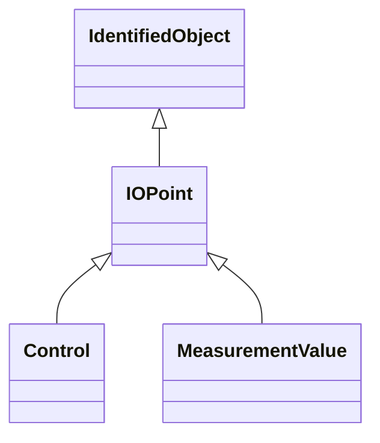

# IOPoint

The class describe a measurement or control value. The purpose is to enable having attributes and associations common for measurement and control.

## Inheritance

<button class="mermaid-enlarge-button">Enlarge Diagram</button>

## Attributes

| Label | Type | Multiplicity | Comment |
|-------|------|--------------|---------|
| No attributes | | | |

