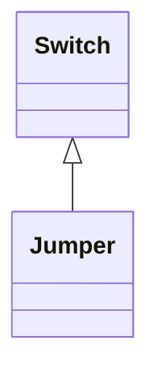

# Jumper

A short section of conductor with negligible impedance which can be manually removed and replaced if the circuit is de-energized. Note that zero-impedance branches can potentially be modelled by other equipment types.

## Inheritance

<button class="mermaid-enlarge-button">Enlarge Diagram</button>

## Attributes

| Label | Type | Multiplicity | Comment |
|-------|------|--------------|---------|
| No attributes | | | |

