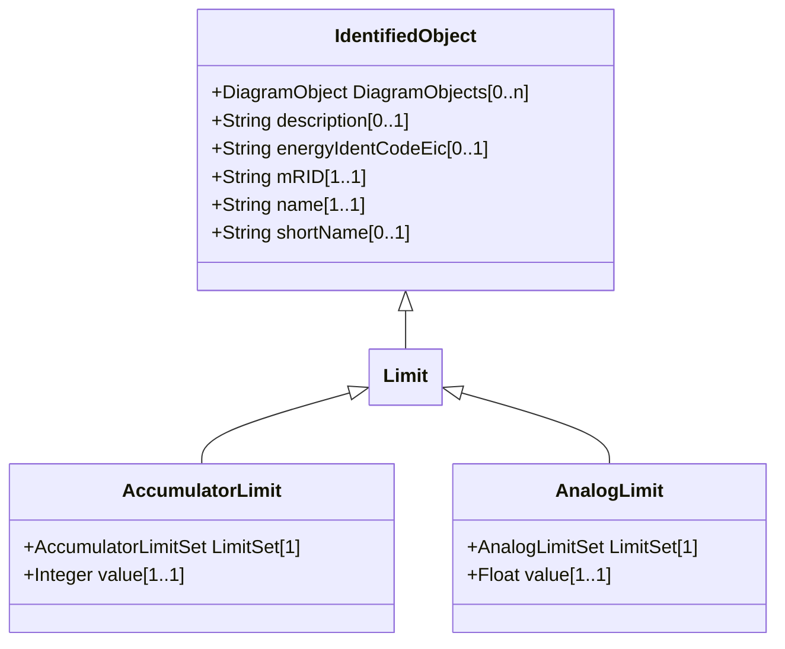

# Limit

Specifies one limit value for a Measurement. A Measurement typically has several limits that are kept together by the LimitSet class. The actual meaning and use of a Limit instance (i.e., if it is an alarm or warning limit or if it is a high or low limit) is not captured in the Limit class. However the name of a Limit instance may indicate both meaning and use.

## Inheritance

<button class="mermaid-enlarge-button">Enlarge Diagram</button>

## Attributes

| Label | Type | Multiplicity | Comment |
|-------|------|--------------|---------|
| No attributes | | | |

