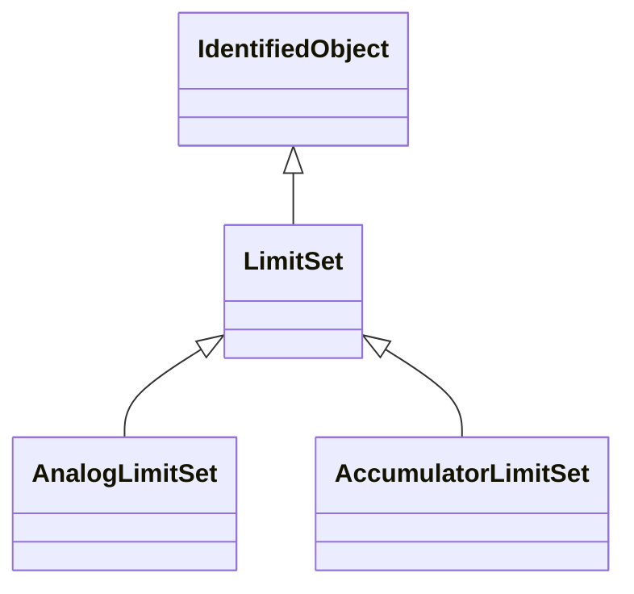

# LimitSet

Specifies a set of Limits that are associated with a Measurement. A Measurement may have several LimitSets corresponding to seasonal or other changing conditions. The condition is captured in the name and description attributes. The same LimitSet may be used for several Measurements. In particular percentage limits are used this way.

## Inheritance

<button class="mermaid-enlarge-button">Enlarge Diagram</button>

## Attributes

| Label | Type | Multiplicity | Comment |
|-------|------|--------------|---------|
| isPercentageLimits | Boolean | 0..1 | Tells if the limit values are in percentage of normalValue or the specified Unit for Measurements and Controls. |

