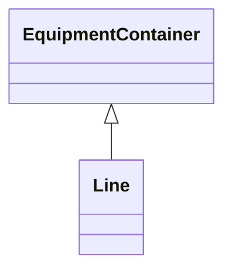

# Line

Contains equipment beyond a substation belonging to a power transmission line.

## Inheritance

<button class="mermaid-enlarge-button">Enlarge Diagram</button>

## Attributes

| Label | Type | Multiplicity | Comment |
|-------|------|--------------|---------|
| Region | [SubGeographicalRegion](SubGeographicalRegion.md) | 0..1 | The sub-geographical region of the line. |

