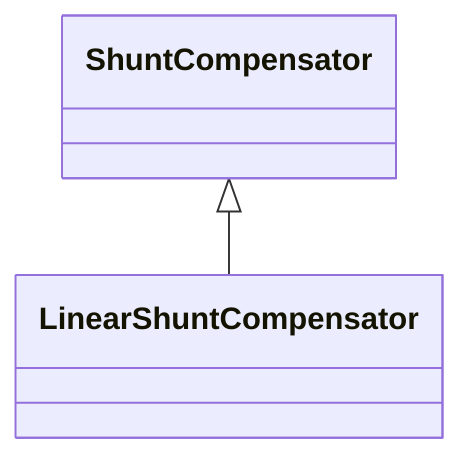

# LinearShuntCompensator

A linear shunt compensator has banks or sections with equal admittance values.

## Inheritance

<button class="mermaid-enlarge-button">Enlarge Diagram</button>

## Attributes

| Label | Type | Multiplicity | Comment |
|-------|------|--------------|---------|
| b0PerSection | Float | 1..1 | Zero sequence shunt (charging) susceptance per section. |
| bPerSection | Float | 1..1 | Positive sequence shunt (charging) susceptance per section. |
| g0PerSection | Float | 1..1 | Zero sequence shunt (charging) conductance per section. |
| gPerSection | Float | 1..1 | Positive sequence shunt (charging) conductance per section. |

