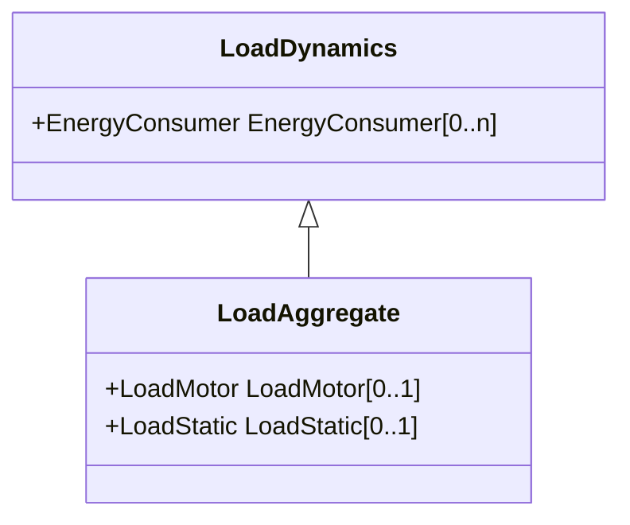

# LoadAggregate

Aggregate loads are used to represent all or part of the real and reactive load from one or more loads in the static (power flow) data. This load is usually the aggregation of many individual load devices and the load model is an approximate representation of the aggregate response of the load devices to system disturbances. Standard aggregate load model comprised of static and/or dynamic components. A static load model represents the sensitivity of the real and reactive power consumed by the load to the amplitude and frequency of the bus voltage. A dynamic load model can be used to represent the aggregate response of the motor components of the load.

## Inheritance

<button class="mermaid-enlarge-button">Enlarge Diagram</button>

## Attributes

| Label | Type | Multiplicity | Comment |
|-------|------|--------------|---------|
| LoadMotor | [LoadMotor](LoadMotor.md) | 0..1 | Aggregate motor (dynamic) load associated with this aggregate load. |
| LoadStatic | [LoadStatic](LoadStatic.md) | 0..1 | Aggregate static load associated with this aggregate load. |

