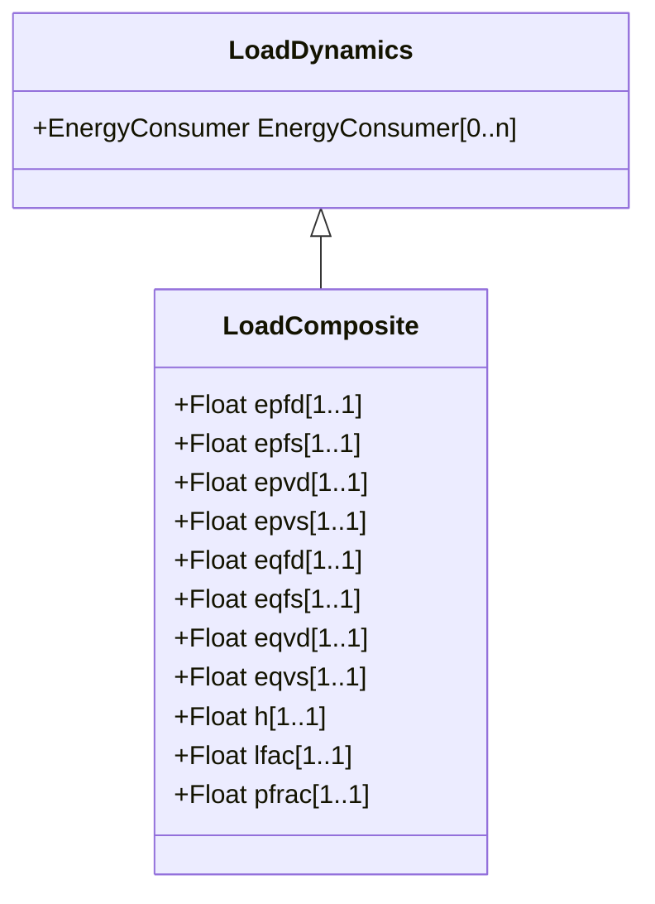

# LoadComposite

Combined static load and induction motor load effects. The dynamics of the motor are simplified by linearizing the induction machine equations.

## Inheritance

<button class="mermaid-enlarge-button">Enlarge Diagram</button>

## Attributes

| Label | Type | Multiplicity | Comment |
|-------|------|--------------|---------|
| epfd | Float | 1..1 | Active load-frequency dependence index (dynamic) (Epfd). Typical value = 1,5. |
| epfs | Float | 1..1 | Active load-frequency dependence index (static) (Epfs). Typical value = 1,5. |
| epvd | Float | 1..1 | Active load-voltage dependence index (dynamic) (Epvd). Typical value = 0,7. |
| epvs | Float | 1..1 | Active load-voltage dependence index (static) (Epvs). Typical value = 0,7. |
| eqfd | Float | 1..1 | Reactive load-frequency dependence index (dynamic) (Eqfd). Typical value = 0. |
| eqfs | Float | 1..1 | Reactive load-frequency dependence index (static) (Eqfs). Typical value = 0. |
| eqvd | Float | 1..1 | Reactive load-voltage dependence index (dynamic) (Eqvd). Typical value = 2. |
| eqvs | Float | 1..1 | Reactive load-voltage dependence index (static) (Eqvs). Typical value = 2. |
| h | Float | 1..1 | Inertia constant (H) (>= 0). Typical value = 2,5. |
| lfac | Float | 1..1 | Loading factor (Lfac). The ratio of initial P to motor MVA base. Typical value = 0,8. |
| pfrac | Float | 1..1 | Fraction of constant-power load to be represented by this motor model (PFRAC) (>= 0,0 and <= 1,0). Typical value = 0,5. |

