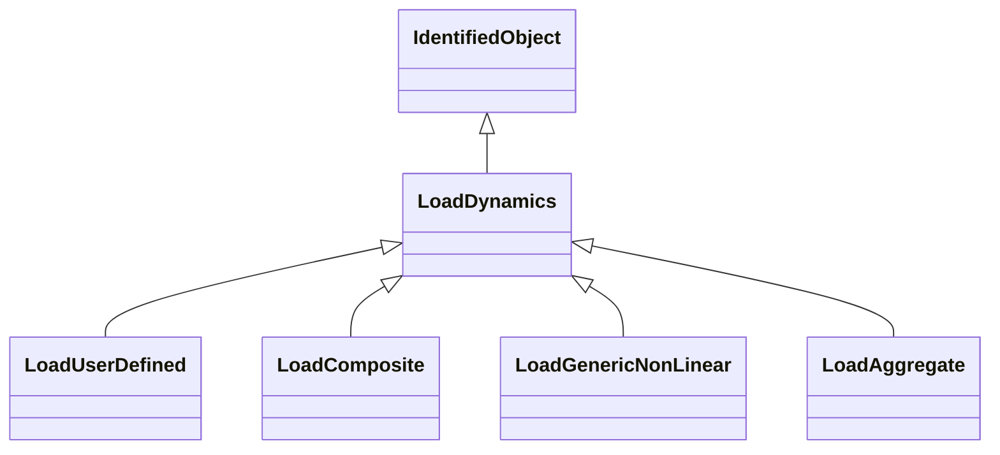

# LoadDynamics

Load whose behaviour is described by reference to a standard model or by definition of a user-defined model. A standard feature of dynamic load behaviour modelling is the ability to associate the same behaviour to multiple energy consumers by means of a single load definition. The load model is always applied to individual bus loads (energy consumers).

## Inheritance

<button class="mermaid-enlarge-button">Enlarge Diagram</button>

## Attributes

| Label | Type | Multiplicity | Comment |
|-------|------|--------------|---------|
| EnergyConsumer | [EnergyConsumer](EnergyConsumer.md) | 0..n | Energy consumer to which this dynamics load model applies. |

