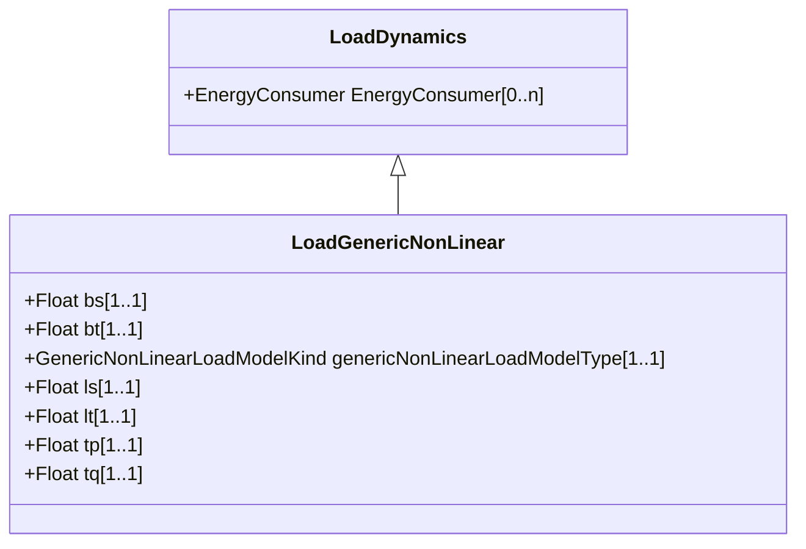

# LoadGenericNonLinear

Generic non-linear dynamic (GNLD) load. This model can be used in mid-term and long-term voltage stability simulations (i.e., to study voltage collapse), as it can replace a more detailed representation of aggregate load, including induction motors, thermostatically controlled and static loads.

## Inheritance

<button class="mermaid-enlarge-button">Enlarge Diagram</button>

## Attributes

| Label | Type | Multiplicity | Comment |
|-------|------|--------------|---------|
| bs | Float | 1..1 | Steady state voltage index for reactive power (BS). |
| bt | Float | 1..1 | Transient voltage index for reactive power (BT). |
| genericNonLinearLoadModelType | [GenericNonLinearLoadModelKind](GenericNonLinearLoadModelKind.md) | 1..1 | Type of generic non-linear load model. |
| ls | Float | 1..1 | Steady state voltage index for active power (LS). |
| lt | Float | 1..1 | Transient voltage index for active power (LT). |
| tp | Float | 1..1 | Time constant of lag function of active power (TP) (> 0). |
| tq | Float | 1..1 | Time constant of lag function of reactive power (TQ) (> 0). |

