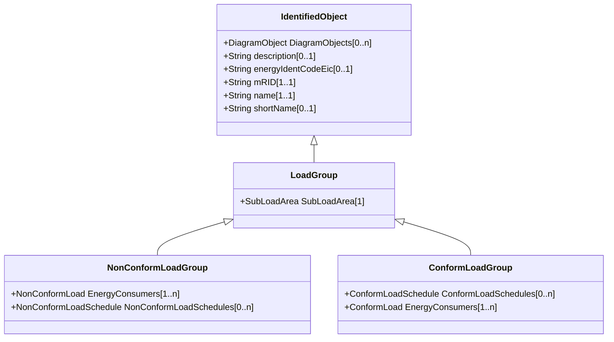

# LoadGroup

The class is the third level in a hierarchical structure for grouping of loads for the purpose of load flow load scaling.

## Inheritance

<button class="mermaid-enlarge-button">Enlarge Diagram</button>

## Attributes

| Label | Type | Multiplicity | Comment |
|-------|------|--------------|---------|
| SubLoadArea | [SubLoadArea](SubLoadArea.md) | 1 | The SubLoadArea where the Loadgroup belongs. |

