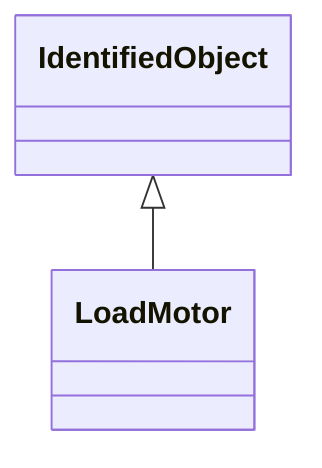

# LoadMotor

Aggregate induction motor load. This model is used to represent a fraction of an ordinary load as 'induction motor load'. It allows a load that is treated as an ordinary constant power in power flow analysis to be represented by an induction motor in dynamic simulation. This model is intended for representation of aggregations of many motors dispersed through a load represented at a high voltage bus but where there is no information on the characteristics of individual motors. Either a 'one-cage' or 'two-cage' model of the induction machine can be modelled. Magnetic saturation is not modelled. This model treats a fraction of the constant power part of a load as a motor. During initialisation, the initial power drawn by the motor is set equal to Pfrac times the constant P part of the static load. The remainder of the load is left as a static load. The reactive power demand of the motor is calculated during initialisation as a function of voltage at the load bus. This reactive power demand can be less than or greater than the constant Q component of the load. If the motor's reactive demand is greater than the constant Q component of the load, the model inserts a shunt capacitor at the terminal of the motor to bring its reactive demand down to equal the constant Q reactive load. If an induction motor load model and a static load model are both present for a load, the motor Pfrac is assumed to be subtracted from the power flow constant P load before the static load model is applied. The remainder of the load, if any, is then represented by the static load model.

## Inheritance

<button class="mermaid-enlarge-button">Enlarge Diagram</button>

## Attributes

| Label | Type | Multiplicity | Comment |
|-------|------|--------------|---------|
| LoadAggregate | [LoadAggregate](LoadAggregate.md) | 1 | Aggregate load to which this aggregate motor (dynamic) load belongs. |
| d | Float | 1..1 | Damping factor (D). Unit = delta P/delta speed. Typical value = 2. |
| h | Float | 1..1 | Inertia constant (H) (>= 0). Typical value = 0,4. |
| lfac | Float | 1..1 | Loading factor (Lfac). The ratio of initial P to motor MVA base. Typical value = 0,8. |
| lp | Float | 1..1 | Transient reactance (Lp). Typical value = 0,15. |
| lpp | Float | 1..1 | Subtransient reactance (Lpp). Typical value = 0,15. |
| ls | Float | 1..1 | Synchronous reactance (Ls). Typical value = 3,2. |
| pfrac | Float | 1..1 | Fraction of constant-power load to be represented by this motor model (Pfrac) (>= 0,0 and <= 1,0). Typical value = 0,3. |
| ra | Float | 1..1 | Stator resistance (Ra). Typical value = 0. |
| tbkr | Float | 1..1 | Circuit breaker operating time (Tbkr) (>= 0). Typical value = 0,08. |
| tpo | Float | 1..1 | Transient rotor time constant (Tpo) (>= 0). Typical value = 1. |
| tppo | Float | 1..1 | Subtransient rotor time constant (Tppo) (>= 0). Typical value = 0,02. |
| tv | Float | 1..1 | Voltage trip pickup time (Tv) (>= 0). Typical value = 0,1. |
| vt | Float | 1..1 | Voltage threshold for tripping (Vt). Typical value = 0,7. |

