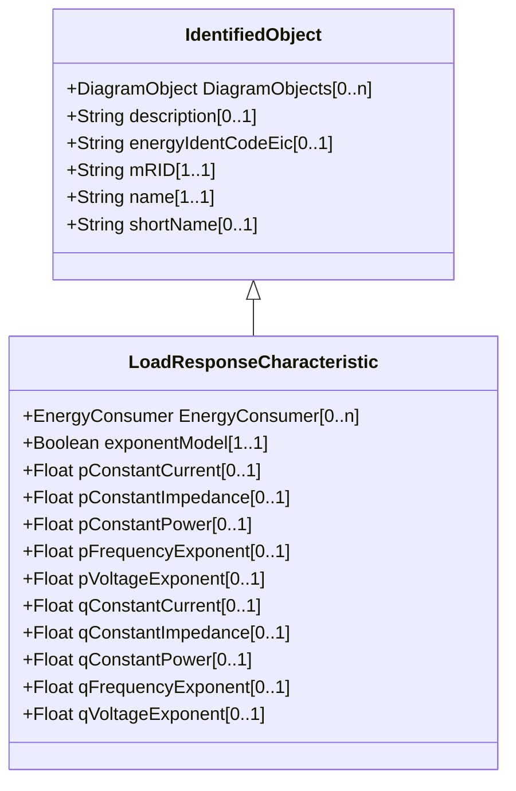

# LoadResponseCharacteristic

Models the characteristic response of the load demand due to changes in system conditions such as voltage and frequency. It is not related to demand response. If LoadResponseCharacteristic.exponentModel is True, the exponential voltage or frequency dependent models are specified and used as to calculate active and reactive power components of the load model. The equations to calculate active and reactive power components of the load model are internal to the power flow calculation, hence they use different quantities depending on the use case of the data exchange. The equations for exponential voltage dependent load model injected power are: pInjection= Pnominal* (Voltage/cim:BaseVoltage.nominalVoltage) ** cim:LoadResponseCharacteristic.pVoltageExponent qInjection= Qnominal* (Voltage/cim:BaseVoltage.nominalVoltage) ** cim:LoadResponseCharacteristic.qVoltageExponent Where: 1) * means 'multiply' and ** is 'raised to power of'; 2) Pnominal and Qnominal represent the active power and reactive power at nominal voltage as any load described by the voltage exponential model shall be given at nominal voltage. This means that EnergyConsumer.p and EnergyConsumer.q are at nominal voltage. 3) After power flow is solved: -pInjection and qInjection correspond to SvPowerflow.p and SvPowerflow.q respectively. - Voltage corresponds to SvVoltage.v at the TopologicalNode where the load is connected.

## Inheritance

<button class="mermaid-enlarge-button">Enlarge Diagram</button>

## Attributes

| Label | Type | Multiplicity | Comment |
|-------|------|--------------|---------|
| EnergyConsumer | [EnergyConsumer](EnergyConsumer.md) | 0..n | The set of loads that have the response characteristics. |
| exponentModel | Boolean | 1..1 | Indicates the exponential voltage dependency model is to be used. If false, the coefficient model is to be used. The exponential voltage dependency model consist of the attributes: - pVoltageExponent - qVoltageExponent - pFrequencyExponent - qFrequencyExponent. The coefficient model consist of the attributes: - pConstantImpedance - pConstantCurrent - pConstantPower - qConstantImpedance - qConstantCurrent - qConstantPower. The sum of pConstantImpedance, pConstantCurrent and pConstantPower shall equal 1. The sum of qConstantImpedance, qConstantCurrent and qConstantPower shall equal 1. |
| pConstantCurrent | Float | 0..1 | Portion of active power load modelled as constant current. |
| pConstantImpedance | Float | 0..1 | Portion of active power load modelled as constant impedance. |
| pConstantPower | Float | 0..1 | Portion of active power load modelled as constant power. |
| pFrequencyExponent | Float | 0..1 | Exponent of per unit frequency effecting active power. |
| pVoltageExponent | Float | 0..1 | Exponent of per unit voltage effecting real power. |
| qConstantCurrent | Float | 0..1 | Portion of reactive power load modelled as constant current. |
| qConstantImpedance | Float | 0..1 | Portion of reactive power load modelled as constant impedance. |
| qConstantPower | Float | 0..1 | Portion of reactive power load modelled as constant power. |
| qFrequencyExponent | Float | 0..1 | Exponent of per unit frequency effecting reactive power. |
| qVoltageExponent | Float | 0..1 | Exponent of per unit voltage effecting reactive power. |

