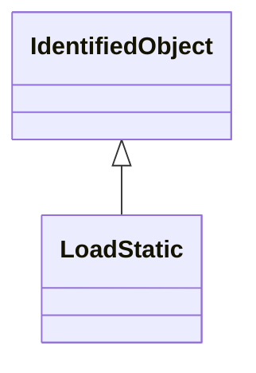

# LoadStatic

General static load. This model represents the sensitivity of the real and reactive power consumed by the load to the amplitude and frequency of the bus voltage.

## Inheritance

<button class="mermaid-enlarge-button">Enlarge Diagram</button>

## Attributes

| Label | Type | Multiplicity | Comment |
|-------|------|--------------|---------|
| LoadAggregate | [LoadAggregate](LoadAggregate.md) | 1 | Aggregate load to which this aggregate static load belongs. |
| ep1 | Float | 0..1 | First term voltage exponent for active power (Ep1). Used only when .staticLoadModelType = exponential. |
| ep2 | Float | 0..1 | Second term voltage exponent for active power (Ep2). Used only when .staticLoadModelType = exponential. |
| ep3 | Float | 0..1 | Third term voltage exponent for active power (Ep3). Used only when .staticLoadModelType = exponential. |
| eq1 | Float | 0..1 | First term voltage exponent for reactive power (Eq1). Used only when .staticLoadModelType = exponential. |
| eq2 | Float | 0..1 | Second term voltage exponent for reactive power (Eq2). Used only when .staticLoadModelType = exponential. |
| eq3 | Float | 0..1 | Third term voltage exponent for reactive power (Eq3). Used only when .staticLoadModelType = exponential. |
| kp1 | Float | 0..1 | First term voltage coefficient for active power (Kp1). Not used when .staticLoadModelType = constantZ. |
| kp2 | Float | 0..1 | Second term voltage coefficient for active power (Kp2). Not used when .staticLoadModelType = constantZ. |
| kp3 | Float | 0..1 | Third term voltage coefficient for active power (Kp3). Not used when .staticLoadModelType = constantZ. |
| kp4 | Float | 0..1 | Frequency coefficient for active power (Kp4) (not = 0 if .staticLoadModelType = zIP2). Used only when .staticLoadModelType = zIP2. |
| kpf | Float | 0..1 | Frequency deviation coefficient for active power (Kpf). Not used when .staticLoadModelType = constantZ. |
| kq1 | Float | 0..1 | First term voltage coefficient for reactive power (Kq1). Not used when .staticLoadModelType = constantZ. |
| kq2 | Float | 0..1 | Second term voltage coefficient for reactive power (Kq2). Not used when .staticLoadModelType = constantZ. |
| kq3 | Float | 0..1 | Third term voltage coefficient for reactive power (Kq3). Not used when .staticLoadModelType = constantZ. |
| kq4 | Float | 0..1 | Frequency coefficient for reactive power (Kq4) (not = 0 when .staticLoadModelType = zIP2). Used only when .staticLoadModelType - zIP2. |
| kqf | Float | 0..1 | Frequency deviation coefficient for reactive power (Kqf). Not used when .staticLoadModelType = constantZ. |
| staticLoadModelType | [StaticLoadModelKind](StaticLoadModelKind.md) | 1..1 | Type of static load model. Typical value = constantZ. |

